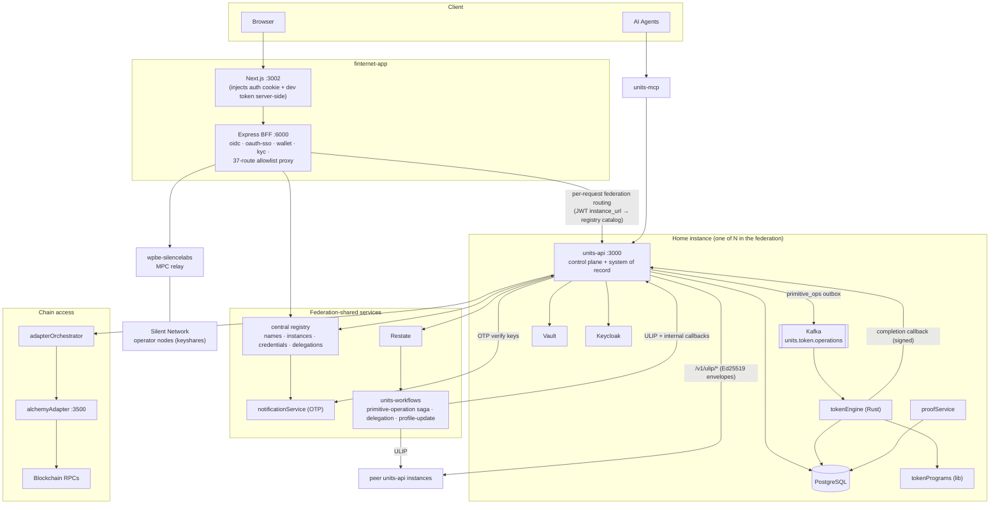
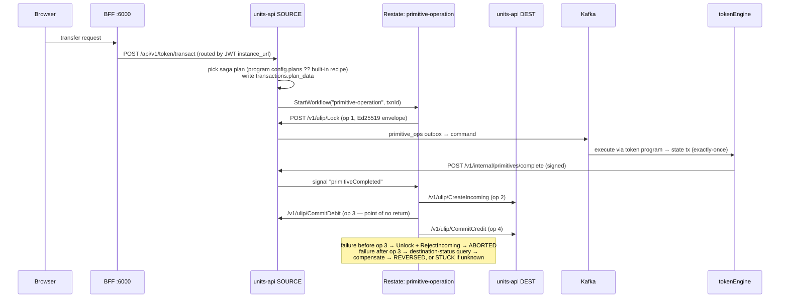

# Finternet Platform — Architecture Overview

> Generated 2026-08-03 from the `finternet` monorepo source (verified against code, not just sub-project CLAUDE.md files — several of which are stale; corrections are flagged throughout these docs).

**Finternet** is a multi-service platform for **tokenized asset management**, deployed as a **federation of instances**: each user has a *home instance* (a units-api + its database), instances discover each other through a **central registry**, and cross-instance transfers run as sagas over the **ULIP** peer protocol.

## Document Map

| Doc | Contents |
|-----|----------|
| [00-overview.md](00-overview.md) | This file — platform map, block diagrams, data flows, shared patterns |
| [01-units-api.md](01-units-api.md) | Core Go REST API — accounts, tokens, keys, federation, workflows, authz |
| [02-units-token-runtime.md](02-units-token-runtime.md) | Rust Token Engine (Kafka consumer) + Token Programs library |
| [03-finternet-app.md](03-finternet-app.md) | Next.js frontend + Express BFF server |
| [04-units-services-and-adapters.md](04-units-services-and-adapters.md) | Notification (OTP), adapter orchestrator, proof service, central registry, chain adapters |
| [05-workflows-wallet-mcp.md](05-workflows-wallet-mcp.md) | Restate workflows, MPC wallet provider (wpbe), MCP server, local dev stack |
| [06-database-schemas.md](06-database-schemas.md) | All PostgreSQL table schemas (canonical DDL owned by units-api) + BFF Prisma tables |
| [07-diagrams.md](07-diagrams.md) | All block/sequence/ER diagrams in one place |

## Service Map

### Core runtime services

| Service | Language / Stack | Purpose | Port |
|-----------|----------|---------|------|
| `finternet-app` | TypeScript — Next.js 15 + Express (pnpm/Turborepo) | Frontend app + BFF (allowlist proxy, OIDC provider, OAuth SSO, wallet, KYC) | 3002 / 6000 |
| `units-api` | Go 1.25 — Fiber | Control plane + system of record: accounts, tokens, keys, federation (ULIP), workflows, authz | 3000 |
| `units-token-runtime/tokenEngine` | Rust | Kafka consumer executing token operations; persists state to Postgres | 8080 (health) |
| `units-token-runtime/tokenPrograms` | Rust library | Pluggable token program implementations (FT, NFT) | — |
| `units-services/notificationService` | Node.js/Express | OTP generate/verify; mints the OTP JWT (EdDSA) | 4000 |
| `units-services/adapterOrchestrator` | Go/Fiber | Routes chain calls to the right adapter via `adapter_registry` | 8090 |
| `units-services/proofService` | Rust/Axum | BLAKE3 Merkle batch prover (background worker) | 8081 |
| `units-services/registry` | Go/Fiber | **Central federation registrar** — names/DIDs, instance catalog, developer credentials, delegations | 3000/3001/9090 |
| `units-adapters/alchemyAdapter` | Go/Fiber | Chain adapter — 31 chains (EVM + Solana) via Alchemy | 3500 |
| `units-workflows` | TypeScript — Restate SDK | Durable workflows: profile-update, delegation(+revoke), primitive-operation saga | 9080+ |
| `wpbe-silencelabs` | Rust/Axum | Wallet Provider Backend — Silence Labs threshold-MPC relay (stateless) | 8090 |
| `units-mcp` | TypeScript/Express | MCP server exposing UNITS API as read-only tools for AI agents | 3000 |

### Infra / ops

| Directory | Purpose |
|-----------|---------|
| `finternet-services/` | Docker Compose local dev environment (Postgres, Kafka KRaft, Keycloak, Vault, MinIO, HyperDX, units-api, token-engine, OTP, app) |
| `helmcharts/` | Helm charts for all platform apps + infra |
| `units-automation/` | Terraform/Terragrunt (GCP/AWS) + ArgoCD GitOps |
| `kube-config/` | Kubernetes manifests |
| `stubs/` | Test harnesses (federation-test-harness, nfh-airdrop) |

## Top-Level Block Diagram

## Primary Data Flow — Token Transfer (cross-instance saga)

> **Correction to older docs:** units-api no longer publishes to Kafka directly from `/token/transact`. Every operation routes through a Restate-driven saga; Kafka is reached via the `primitive_ops` outbox on each ULIP primitive admit.

## Key Architectural Decisions

- **Federated multi-instance model** — accounts live on a *home instance*; the BFF resolves the upstream per request from the JWT `instance_url` claim validated against the central registry catalog. Cross-instance transfers are prepare/commit sagas over signed ULIP envelopes.
- **Token amounts are strings** everywhere (Go → Kafka → Rust; parsed as `u128` in Rust).
- **Envelopes:** requests are `{ context, payload }`; **responses are `{ context, response }`**. ULIP peer calls use a distinct snake_case envelope with Ed25519 signatures.
- **Chained SHA-256 state commitments** (tamper detection) + **optimistic locking** (`state_version`). Delegation-managed identity entries (`["access"]`) are excluded from commitment hashing — that set is triplicated across Rust/TypeScript/SQL and must stay in sync.
- **Double-entry bookkeeping** — transfers produce debit + credit `token_transactions` rows.
- **Token Engine is operation-agnostic** — business logic lives in Token Programs behind the `TokenProgram` trait; saga plans can be self-declared by programs (`config.plans`).
- **`primitive_ops` is the saga backbone** — one row per `(txn_id, op_seq)` with disjoint column groups written by up to 6 concurrent writers (gateway, pollers, engine) via targeted UPDATEs; the engine writes inside the token-state transaction for exactly-once execution.
- **Centralized DDL** — platform schema in `units-api/specs/db/` (21 tables); the central registry and the BFF own their separate schemas.
- **BFF pattern with an explicit allowlist** — no `/api/v1/*` wildcard; 37 declared routes in `config/defaults.yaml`, malformed allowlist refuses to boot. Auth cookie and developer token are injected server-side and never reach the browser.

## Cross-Service Contracts

| Shared Contract | Owner | Consumers |
|----------------|-------|-----------|
| Kafka message (`utils.TokenOperationEvent`, key = txId) | units-api | tokenEngine |
| PostgreSQL schema (`specs/db/`, 21 tables) | units-api | tokenEngine, proofService, units-workflows (`@units/db`) |
| `adapter_registry` table | units-api | adapterOrchestrator |
| `{context, payload}` request / `{context, response}` response | units-api | all services |
| ULIP envelope + JCS canonical signing input | units-api ↔ units-workflows | peer instances (golden-corpus pinned, byte-compatible Go/TS) |
| `plan_data` / `planHash` (Go omitempty-compatible SHA-256) | units-api | units-workflows |
| `TokenProgram` trait | tokenPrograms/interface | tokenEngine, program crates |
| State commitment algorithm + delegation-managed types | tokenPrograms/core | tokenEngine, units-workflows, units-api DDL |
| `workflow_registry` self-registration | units-workflows | units-api dispatcher |
| OTP JWT (EdDSA, verified via issuer `/.well-known/ulip.json`) | notificationService | units-api, registry, BFF (shared signing key, ADR 0002) |
| Instance catalog / contact resolution | central registry | BFF, units-api, workflows |

## Shared Patterns

- **DI:** Go → Uber `dig`; Rust → manual wiring; TS workflows → Restate SDK
- **Config:** Go → Viper + JSON-encoded env vars (`APP_CONFIG`, `DB_CONFIG`, …); Rust → dotenvy + JSON env vars; finternet-app → YAML (`config/defaults.yaml` + git-ignored `overrides.yaml`)
- **Database access:** Go → GORM; Rust → SQLx; finternet-app & units-workflows → Prisma
- **HTTP frameworks:** Go → Fiber; Rust → Axum; BFF → Express; frontend → Next.js App Router
- **Observability:** OpenTelemetry throughout (otelzap / tracing / HyperDX); snake_case event names (`account_created`, `token_minted`)
- **Frontend state:** Redux Toolkit (10 slices); React Query present only as a wagmi/AppKit dependency
- **CI:** GitHub Actions per sub-project
