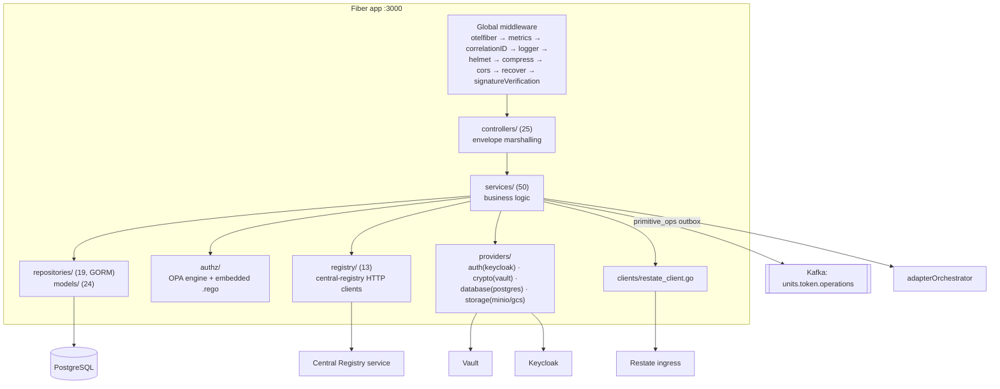
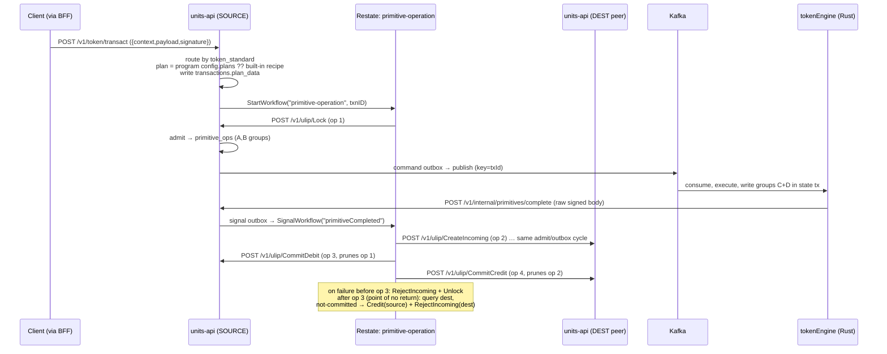

# units-api — Core Platform API

**Path:** `units-api/` · **Stack:** Go 1.25, Fiber v2, GORM + PostgreSQL, Uber `dig` (DI), Viper (JSON-encoded env config), OPA/Rego (authz), Kafka (segmentio/kafka-go), HashiCorp Vault (transit/PII), Keycloak (OIDC), MinIO/GCS, Restate, OpenTelemetry
**Port:** 3000 · **Route prefix:** `/v1` · **Go module name:** `app` (all imports are `app/src/...`)

## Purpose

units-api is the **control plane and system of record** for the platform. Everything that mutates platform state passes through it, and it owns the canonical PostgreSQL schema (see [06-database-schemas.md](06-database-schemas.md)) that the Rust token runtime and proof service also read.

Responsibilities: account/identity lifecycle (OTP + BFF-signed authToken login, Vault-encrypted PII, `did:web`), address registry (local + federated resolution), key management (`key_references` as single source of truth for mpc/vault_transit/external keys), token lifecycle (mint/transact/add/get/search), registries (token classes/configs/programs, chains, wallet providers, adapters), transactions + Merkle proofs, **ULIP federation** (17 peer-facing primitives, cross-instance transfer sagas), workflow orchestration over Restate, two-token authorization (service-account credential + user JWT, OPA/Rego RBAC with delegations), API client/service-account management, versioned terms & consent, and append-only audit.

> **Three corrections to older docs (verified in code):**
> 1. **`/token/transact` no longer publishes to Kafka directly.** All operations route through the federation saga (`StartTransfer`) or domain lifecycle (`StartDomainLifecycle`); Kafka is reached only via the ULIP primitive gateway → `primitive_ops` outbox. The legacy path fails loudly (`transact_not_routed`, `src/services/token.go:945`).
> 2. **`api_clients`, `api_keys`, `scopes`, `scope_apis`, `delegations`, `rate_limit_*` are not local tables** — they live in a separate **central registry service**, reached over HTTP via `src/registry/`. The GORM models are typed wire shapes only.
> 3. **The response envelope is `{context, response}`, not `{context, payload}`** — only requests use `payload`.

## Internal Architecture



**DI:** Uber `dig`; `containers.NewContainer()` provides ~110 constructors (config → OTel → providers → 17 repositories → federation slice → Restate client → ~35 services → authz engine → 13 middlewares → 25 controllers → router → DB → app). Registry/ULIP/instance env vars enter via `ProvideXxx` wrappers reading `os.Getenv` directly (bypassing Viper).

**Config:** Viper `AutomaticEnv()` with **JSON-encoded env vars**: `APP_CONFIG`, `FEATURE_FLAGS`, `KAFKA_CONFIG`, `METRICS_CONFIG`, `AUTHTOKEN_CONFIG`, `AUTH_CONFIG`, `DB_CONFIG`, `STORAGE_CONFIG`, `CRYPTO_CONFIG`. Plain scalars: `AUTH_PROVIDER`, `DB_PROVIDER`, `STORAGE_PROVIDER`, `CRYPTO_PROVIDER`, `SCHEMA_PATH`, `OTP_JWT_PUBLIC_KEY`, `ORCHESTRATOR_URL`, `DID_WEB_DOMAIN` (required), `RESTATE_INGRESS_URL`. Feature flags: `enableDevTokenVerification` (default **true**; off = SA auth AND scope checks no-op, loud boot warning), `enableSignatureVerification` (true), `enableFederation`, `enableUserScopeCheck`, `enableConsentEnforcement` (all false).

## Request Envelope

```go
// Request
{ "context": { id, version, ts, msgId, transactionId?, developerToken?,   // ONLY channel for the SA credential
               developerSignature?, authorization?, debug?, valueFormat? },
  "payload": { ... },
  "signature": { "keyId": "<key_references UUID>", "jws": "..." }? }

// Response — note: "response", not "payload"
{ "context": { id, version, ts, msgId, transactionId?, status: successful|failed|pending, error?: {code,message} },
  "response": { ... } }   // errors return {} — never null
```

Three surfaces bypass the envelope: `/v1/internal/primitives/complete` (raw signed engine callback), `/v1/ulip/*` (ULIP envelope), and legacy GET routes.

## Authentication & Authorization Model

**Two-token model:**
- **Service-account credential** — `base64(clientId:clientSecret)` in `context.developerToken` only (header fallbacks removed). Resolved against the central registry with a fail-closed short cache (not-found → 401 negative-cached; transport errors → 503, not cached). Malformed credentials get an opaque 401. Never seeds an acting user identity.
- **User JWT** — `context.authorization`. `AuthenticateUser` is *optional-if-absent* (machine/federated calls proceed on SA authority alone), 401 if present-and-invalid.

**Scopes:** every route declares an `api.x.y` API ID → resolved to a required scope via the registry-backed catalog (Ristretto caches, TTL 86400s default). SA scope check (403 `CLIENT_INSUFFICIENT_SCOPE`) then user scope check (403 `USER_INSUFFICIENT_SCOPE`, skipped when no user). Level-2 **`allowed_operations`** narrowing: `{scope: {dot.path: [allowed values]}}` — every listed dot-path must resolve in the body AND match (AND semantics; missing path fails closed). Super-admins early-return (documented gap, issue #270).

**OPA/Rego RBAC** (`src/authz/`, embedded, compiled at startup): permission hierarchy is **flattened** (manage ≠ transact ≠ view — no implicit grant). Rules: operation blocks first → Rule 1 owner → Rule 2 token-class manager → Rule 2b *any identity on the token may VIEW* → Rule 3 delegation-based. Engine failures surface as opaque `authorization_unavailable`.

**Other middleware:** rate limiting (registry tier/rules per SA), consent gate (403 `TERMS_CONSENT_REQUIRED`, **fails open** on transient errors; applied to account/update, token/mint, token/transact, workflows execute/cancel), request signature (`RequireSignature` — **only `/token/transact`**; verifies a JWS over the RFC 8785 JCS-canonicalized payload against the `key_references` public key, Ed25519 only), JSON Schema validation (73 schema files).

## API Surface (113 routes, all `/v1` unless noted)

Chain legend: **E**=ParseRequestEnvelope · **SA**=AuthenticateServiceAccount · **S**=CheckServiceAccountScope · **RL**=RateLimit · **U**=AuthenticateUser · **U?**=optional user auth · **US**=CheckUserScope · **C**=RequireConsent · **Sig**=RequireSignature · **V**=schema validation. Default full chain = E,SA,S,RL,U,US,V.

### Health / docs / well-known
| Method | Path | Notes |
|---|---|---|
| GET | `/health` | Liveness, no auth |
| GET | `/docs/*` | Swagger UI |
| GET | `/.well-known/ulip.json` | Public ULIP capability/JWKS doc, no auth (no `/v1` prefix) |

### Accounts `/account`
| Method | Path | Notes |
|---|---|---|
| POST | `/account/create` | Register; OTP-JWT gated (no session) |
| POST | `/account/login` | OTP or BFF-signed authToken; pre-session |
| POST | `/account/update` | Drives profile-update Restate workflow; +C |
| POST | `/account/get` | Profile |
| POST | `/account/pii/decrypt` | Decrypt own Vault-encrypted PII |
| POST | `/account/logout` | End session |
| POST | `/account/otp/generate` \| `/verify` | U? (works pre- and mid-session) |

### Address `/address`
POST `/address/checkAvailability` (SA-only) · POST `/address/resolve` (address → account/DID/home instance, local + federated).

### Keys `/account/keys`, `/account/sign`
| Method | Path | Notes |
|---|---|---|
| POST | `/account/keys/register` | Unified registration (mpc / vault_transit / external) |
| POST | `/account/keys/remove` \| `/get` \| `/search` | Revoke / fetch / search |
| POST | `/account/keys/create` | New Vault-transit signing key |
| POST | `/account/keys/rotate` | Rotate Vault-transit key |
| POST | `/account/sign` | OTP-gated signing (OTP is the user gate; no user middleware) |
| GET | `/account/keys` | **Intentionally dead** (GET carries no envelope → SA auth fails closed 401) |

### DID
`GET /did/:address` — W3C DID resolution, **disabled** (commented out, issue #56).

### Tokens `/token`
| Method | Path | Notes |
|---|---|---|
| POST | `/token/get` \| `/search` | Detail / paginated JSONB search |
| POST | `/token/mint` | +C |
| POST | `/token/transact` | +C, **+Sig (only signed route)** — transfer/burn/freeze/… |
| POST | `/token/add` | Add proxy/imported token (provider callback path; duplicate add = balance reconcile) |
| POST | `/token/transactions` | Token history |

### Transactions & proofs
| Method | Path | Notes |
|---|---|---|
| POST | `/transaction/status` \| `/get` \| `/search` | Standard tx queries |
| POST | `/transactions/status` | **Federation lifecycle view**, SA-only (machine pollers, no user gate) |
| POST | `/transaction/proof` \| `/proof/leaf` \| `/proof/verify` | Merkle proof / raw leaf / verify |

### Registries
- `/tokenclass/*`, `/tokenclassconfig/*`, `/tokenprogram/*`, `/adapter/*` — each `register|update|get|search` (POST, full chain)
- `/registry/chains/*`, `/registry/wallets/*`, `/registry/tokenclasses/*` — same CRUD quartet
- POST `/registry/capability/publish` (operator, `internal:manage`) · POST `/registry/lookup-address` (on-chain address → account, first-registrant-wins)
- GET `/registry/forwarding/:did`, GET `/instance/capabilities` — intentionally dead (fail-closed GETs)

### Workflows `/workflows`
POST `/workflows/execute` (+C) · `/workflows/status` · `/workflows/cancel` (+C). Generic framework over Restate; delegation mutations (allow/deny/approve/reject/cancel/revoke) are **workflow actions**, not REST routes.

### Clients / scopes / users / delegations
| Method | Path | Notes |
|---|---|---|
| POST | `/clients/register` \| `/get` \| `/list` \| `/update` \| `/deactivate` \| `/rotate-secret` \| `/reactivate` \| `/scopes/update` | Secret plaintext returned exactly once; protected scopes → pending approval |
| POST | `/scopes/search` \| `/scopes/apis/search` | Scope catalog (requires `scopes:view`) |
| POST | `/scope-approvals/` | Pending approvals (visibility filtered by role) |
| POST | `/users/scopes/update` \| `/get` | SA-authority admin ops on a *target* user (Keycloak client roles) |
| POST | `/delegations/list` \| `/check` | Read-side only |

### Terms `/terms`
POST `/terms/get` (no user token — readable during onboarding) · `/terms/accept` · `/terms/publish` (protected `terms:publish` scope).

### Internal `/internal` (machine-only; no user middleware)
| Method | Path | Notes |
|---|---|---|
| POST | `/internal/transactions/destination-status` | Peer queries destination commit status |
| POST | `/internal/transactions/lifecycle-update` | Workflow pushes lifecycle state |
| POST | `/internal/workflow-ops/record` | Workflow audit row |
| POST | `/internal/primitives/complete` | **Raw signed body from the token engine — deliberately no envelope/SA middleware** (auth = payload signature). Adding middleware would permanently wedge cross-instance transfers |
| POST | `/internal/primitives/status` | Peer status read (`{txn_id, op_seq}`, `internal:manage`) |
| POST | `/internal/workflows/register` | Restate services self-register definitions |
| POST | `/internal/identities/cache-evict` | Restamp identities + evict authz caches after registry flips |
| POST | `/internal/delegation/reconcile` | Cross-instance delegation reconcile (fan-out to all instances) |

### ULIP federation `/ulip` (17 routes)
Peer-to-peer; **no dev-token/Keycloak gate** — auth is the ULIP envelope's Ed25519 signature (boot refuses non-local env with signatures off). Distinct snake_case envelope: `{context: {ulip_version, method, txn_id, op_seq, caller_instance, callee_instance, sent_at}, payload: {type_url, value}, signature: {signer_instance, key_id, algorithm, signature}}`; ~26 canonical error codes (`IDEMPOTENT_REPLAY`, `OP_SEQ_OUT_OF_ORDER`, `INSUFFICIENT_BALANCE`, `FORWARD`, …).

- Happy path: `Lock`, `CreateIncoming`, `CommitDebit`, `CommitCredit`
- Failure/extended: `Unlock`, `RejectIncoming`, `Credit`, `Debit`, `RecordProxyEntry`, `Reconcile`, `DomainLifecycle`, `Mint`, `Burn`, `Freeze`, `Unfreeze`, `Update`
- Post-commit: `PruneTokenTransactions`

## Token Operation Flow (end-to-end)



**Built-in saga recipes** (`src/services/operation_planner_recipes.go`, formerly the `primitive_templates` table; a program's self-declared `config.plans` takes precedence):
- `two_party_prepare_commit@2.0` — cross-instance transfer: Lock → CreateIncoming → CommitDebit → CommitCredit; commits retry 5× (1s→30s backoff, 300s max); `pointOfNoReturnOpSeq: 3`; status SUBMITTED → PREPARED → COMMITTING → COMMITTED (ABORTED/STUCK on failure)
- `proxy_record@2.0` — proxy-ledger (stablecoin) transfers
- `domain_lifecycle@2.0` — mint / burn / freeze / unfreeze / update

Federation path gated by token standard (`UNITS-FT`, `ERC-20`, `ERC-3643`, `UNITS-NFT`, `ERC-721`, `UNITS-SFT`, `PURPOSE-BOUND-VOUCHER`, `PROXY-FT`, `STABLES`, reference standards); an empty `token_standard` fails closed (issue #192).

## Integrations

### Kafka (producer contract with tokenEngine)
Topic `units.token.operations`, key = `txId`, `LeastBytes` balancer. The wire struct is **`utils.TokenOperationEvent`** (`src/utils/kafka_helpers.go`):

```go
type TokenOperationEvent struct {
    TxID, Operation, TokenID, TokenClass string
    Payload interface{}
    TraceContext TraceContext            // {traceId, spanId, traceFlags}
    CorrelationID, Timestamp string      // RFC3339 UTC
    Identities []MessageIdentity         // [{id, type, name?}]
    OpSeq int
    CallerInstance, CalleeInstance, WorkflowID, CompletionTarget string
    AssetSelector map[string]interface{}
    RequestEnvelope string
}
```
Production publishes go through the `primitive_ops` command outbox + poller (`PrimitiveOutbox`); direct publish is a test-only fallback.

### Restate
`src/clients/restate_client.go`: `StartWorkflow` (fire-and-forget `/run/send`), `RunWorkflowSync` (blocking `/run`), `SignalWorkflow`, `QueryWorkflow`, `CancelWorkflow`. Workflows: `primitive-operation`, `profile-update`, `delegation`, `delegation-revoke`, `scope-approval`. An **action-handler registry** (`src/handlers/registry.go`) lets Restate call back into units-api business logic per workflow action.

### Central registry (`src/registry/`, ~13 files)
Authoritative for federation names, SA credentials, scopes, delegations, instance catalog. Resolver interface (`ResolveByAddress/ByDID/ByContact`, `LookupInstance`, `LookupPublicKey(ByID)`) with TTL + single-flight caching. Env: `REGISTRY_BASE_URL/DEV_TOKEN/ADMIN_URL/ADMIN_TOKEN`, `REGISTRAR_*`, `LOCAL_INSTANCE_*`, `PUBLIC_API_URL`, `PUBLIC_ULIP_URL`. Capability publisher PUTs this instance's Ed25519-signed capability doc on boot/SIGHUP (registry is off the data-plane critical path).

### Adapter orchestrator
`ORCHESTRATOR_URL` (empty = discovery disabled). `GetHoldings` → `POST /api/v1/chain-adapter/accounts/holdings`; **404 = success with empty holdings** (chain has no adapter).

### Vault / Keycloak / storage / OTP
Provider pattern (interface + factory, selected by `*_PROVIDER` env). Vault: PII encryption (`vault:v1:…` ciphertexts) + transit signing. OTP service issues the account-create JWT; verification prefers the issuer's `/.well-known/ulip.json` by `kid` (RS256/EdDSA), static `OTP_JWT_PUBLIC_KEY` as fallback (ADR-008).

## Background Workers & Lifecycle

| Worker | Purpose |
|---|---|
| `CapabilityPublisher` | Boot/SIGHUP capability publication |
| `AccountSweeper` | Reclaims `address` slots from pending accounts whose signup saga never committed (60s; `SIGNUP_PENDING_TTL`) |
| `PrimitiveOutbox` | Drives command hop (→ Kafka) and signal hop (→ Restate) from `primitive_ops` |

Shutdown order: Fiber stop → AccountSweeper → PrimitiveOutbox → DB close → OTel flush. Boot guard: refuses to start outside local/dev env if `ULIP_REQUIRE_SIGNATURES` is off.

## Testing

`tests/unit/` (mocked deps) · `tests/e2e/` (real Fiber + in-memory SQLite + mocked Vault/Keycloak/Kafka). Make: `test-unit`, `test-e2e`, `test-all`, `test-specific TEST=Name`.

## Operational Cautions

1. **`primitive_ops` has up to 6 concurrent writers (Go + Rust) with disjoint column groups** — all writes must stay targeted `UPDATE … WHERE (txn_id, op_seq)`; a full-row upsert corrupts other writers' state. Engine writes happen inside the token-state SQLx transaction (exactly-once).
2. **Delegation-managed identity types (`["access"]`) are triplicated** across Rust, TypeScript, and SQL comments — drift silently breaks commitment verification. Related: `UpdateIdentities` never bumps `tokens.updated_at`.
3. `/internal/primitives/complete` must never gain envelope/SA middleware (wedges federation).
4. Dead GETs (`/account/keys`, `/registry/forwarding/:did`, `/instance/capabilities`, legacy primitives GET) fail closed by design pending conversion to envelope POSTs.

## Key Files

`src/routers/routers.go` (route map) · `src/utils/kafka_helpers.go` (Kafka contract) · `src/types/common/common.go` (envelopes) · `src/services/operation_planner_recipes.go` (sagas) · `specs/db/V09__primitive_ops.sql` (concurrency model) · `src/authz/policies/rbac.rego` (RBAC) · `src/containers/containers.go` (DI graph) · `src/middlewares/auth.go` (two-token model) · `docs/adr/0001-transactions-status-v2-ownership.md`
