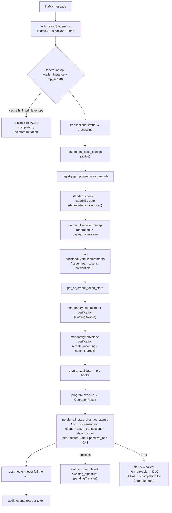

# units-token-runtime — Token Engine + Token Programs

**Path:** `units-token-runtime/` · **Stack:** Rust (rdkafka, SQLx runtime queries, Axum health server, OpenTelemetry)
**Three Cargo projects:** `tokenEngine/` (binary), `tokenPrograms/` (library workspace, 12 crates), `otel-metrics/` (shared metrics crate).

> ⚠️ **The checked-in CLAUDE.md/READMEs in this sub-project are materially stale.** Actual program crates are `fungible`/`non-fungible` (not `reference-ft`/`reference-nft`); there is no `OperationType` enum (`supported_operations()` returns `Vec<String>`); the registry is an immutable `HashMap` (not `Arc<RwLock<>>`); and **`transfer` is not an executable operation** in either reference program — it's a four-primitive saga plan. This document reflects the code.

## tokenEngine — the operation host

An async Rust process that owns all infrastructure — Kafka consumption, Postgres transactions, retries, DLQ, idempotency, hooks, health, telemetry — and is **operation-agnostic**: it routes operations to token programs and never interprets verbs beyond routing, capability gating, and a few special cases (mint-family state lookup, proxy-FT recipient resolution, `create_incoming` placeholders).

The engine **does not migrate** — units-api owns the entire schema, including the `primitive_ops` columns the engine writes.

### Kafka

| Purpose | Topic (default) | Notes |
|---|---|---|
| Consume operations | `units.token.operations` | consumer group `token-engine-group`, manual commits, `auto.offset.reset=earliest` |
| DLQ | `units.token.operations.dlq` | enabled by default |
| Audit events | `units.token.events` | **disabled** by default |

Producer: `acks=all`, idempotent, 3 retries. Offsets are committed on success **and** on terminal failure (failed messages are DLQ'd and never reprocessed). Scaling = more replicas in the consumer group.

**`TokenOperationMessage`** (the units-api → engine contract, camelCase, unknown fields ignored):
`tx_id` (Uuid), `operation` (free string, not an enum), `token_id?`, `token_class`, `payload` (required), `correlation_id`, `trace_context` (W3C), `timestamp`, `identities` (`[{id, type, name?}]` — no flat `initiator`; it's derived operator → sender → minter → first), `signature?`, plus federation fields: `op_seq`, `caller_instance?`, `callee_instance?`, `workflow_id?`, `completion_target?`, `asset_selector?`, `request_envelope?` (base64 ULIP envelope).

### Execution pipeline



**State loading:** mint family (`mint`/`add`/`loan_originated`) resolves the owner's existing token by class (fungible = add to supply) or creates new; existing ops resolve by `token_id` (miss = `TokenNotFound`, except `create_incoming` on an NFT — the only primitive allowed to create a placeholder at a supplied id); without `token_id`, a ladder of proxy lookup (`chainId`+`contractAddress`+`walletAddress`) → owner+class+chain → owner+class → new.

**`additionalStateRequirements`** (declarative, in `token_class_configs.config`): `{key, tokenClass, ownerFrom (initiator|payload.<f>|identity.<t>), tokenIdsFrom?, operations[], multiple}` — how FT burn finds the issuer, loan-pool mint finds constituent loans, and the voucher hook finds beneficiary credentials. All loaded states are commitment-verified.

### Persistence & optimistic locking

Engine table access (11 tables; **zero DELETEs** — strictly append-only/update-in-place):

| Table | Access |
|---|---|
| `tokens` | SELECT / INSERT / UPDATE (owner is in the `identities` JSONB — queried by `@>` containment) |
| `transactions` | status upserts, `response_data`, metadata append |
| `token_transactions`, `state_history` | INSERT (ledger + commitment chain) |
| `token_class_configs`, `token_classes`, `accounts`, `public_key_registry` | SELECT only |
| `token_programs` | boot-time self-registration upsert |
| `audit_events` | INSERT |
| `primitive_ops` | SELECT + UPDATE only (**never INSERT — units-api creates rows**) |

Optimistic locking: `UPDATE tokens … WHERE id=$n AND state_version=$expected` (version re-read inside the same transaction; no `FOR UPDATE`). Zero rows → `ConcurrentModification` (retryable) → whole transaction rolls back by drop → full re-execution. The `primitive_ops` engine-dedup CAS (`WHERE … engine_status IS NULL`) is strictest — a failed CAS rolls back the state mutation to prevent double-spends. A two-leg change commits ~8 statements + the CAS atomically. All engine SQL is runtime-checked (sqlx `macros` off) — schema drift on units-api-owned tables surfaces only at runtime.

### Commitment verification (engine side)

Mandatory pre-check for existing tokens: recompute the commitment **using the config that originally produced it** (persisted per-row in `state_history.commitment_config`) and compare. Mismatch → `DataIntegrityViolation` (non-retryable → DLQ). `previous_commitment` is filled from `state_history`, not `tokens`. ⚠️ Soft-degrade risks: malformed `commitment_config` falls back to the default config; a missing `state_history` row only warns — either can convert a real mismatch into a pass.

### Errors, retry, DLQ

Retryable: `Database(+WithContext)`, `Kafka`, `CompletionCallback`, `StateConflict`, `ConcurrentModification`. Everything else (program errors, not-found, capability denied, integrity violation, hook failure…) is terminal → DLQ. Retry: 3 total attempts, exponential 100ms→30s ×2.0 with 25% jitter. ⚠️ Known DLQ bugs: five error kinds collapse to `UNKNOWN_ERROR` (separate narrower mapping), and DLQ `context` fields are always null (snake_case extractor vs camelCase wire).

### Idempotency & completion outbox

Engine dedup key is strictly `(txn_id, op_seq)` in `primitive_ops` — **local (non-federation) operations are not deduplicated at all**. On execute, the engine writes `engine_status='executed'` + `engine_result` + queues the signed completion callback **inside the state transaction** (exactly-once). Completion delivery: best-effort POST after commit, plus a 5s outbox worker (`FOR UPDATE SKIP LOCKED`, 30s lease, ≤60s backoff, **no max-attempts — retries forever**). Callbacks are Ed25519-signed; the signer disables itself (warn + metric) when signing env is absent.

### Health
Axum on `HEALTH_PORT` (8080): `/health/live` (always 200), `/health/ready` (DB `SELECT 1` + Kafka flag — false only after 5 consecutive receive errors), `/health` alias.

---

## tokenPrograms — the business logic

### Workspace (12 crates)

`interface/` (traits, types, hooks, errors) · `metrics/` · `registry/` · `programs/core/` (commitment algorithm, balance helpers, **`primitive_executor`** — the shared federation-primitive state machine) · `programs/{fungible, non-fungible, credential, stables, purpose-bound-voucher, loan-nft, loan-pool-nft-program, hello-token}`.

### The `TokenProgram` trait

```rust
#[async_trait]
pub trait TokenProgram: Send + Sync {
    // required
    fn program_id(&self) -> &str;
    fn supported_standards(&self) -> Vec<String>;
    fn supported_operations(&self) -> Vec<String>;          // strings, no enum
    async fn execute(&self, ctx: &ExecutionContext, operation: Operation,
                     token_state: TokenState) -> ProgramResult<OperationResult>;
    fn validate_operation(&self, operation: &Operation,
                          token_state: &TokenState) -> ProgramResult<()>;
    fn compute_state_commitment(&self, state: &TokenState) -> String;
    // defaulted
    fn name(&self) -> &str;                                  // = program_id
    fn version(&self) -> &str;                               // "1.0.0"
    fn primitive_capabilities(&self) -> PrimitiveCapabilities; // no_transfer() default
    fn supports_operation(&self, op: &str) -> bool;
    fn supports_standard(&self, std: &str) -> bool;          // case-insensitive
    fn plan(&self, operation: &str) -> Option<OperationPlan>; // None default
}
```

`Hook` trait: `hook_id`, `priority` (lower first), `pre_execute`, `post_execute` → `HookOutput {outcome: Continue|Skip|Fail, modified_state?, metadata?}`. In practice shipped hooks reject via `Err(ProgramError)`, never `Skip`/`Fail`.

### The 8 programs

| Program (`program_id`) | Standards | Operations | Capabilities |
|---|---|---|---|
| `fungible` | UNITS-FT, ERC-3643, ERC-20 | mint, burn, transfer*, freeze, unfreeze, lock, unlock, update, commit_debit, create_incoming, commit_credit, reject_incoming, credit, debit (14) | `fungible_balance` |
| `non-fungible` | UNITS-NFT, ERC-721 | mint, burn, transfer*, **local_transfer**, lock, unlock, create_incoming, reject_incoming, commit_debit, commit_credit (10) | `unique_ownership` |
| `credential` | UNITS-CREDENTIAL, UNITS-SBT, W3C-VC-2.0 | add, revoke, suspend, resume (4 — soulbound, no transfer) | `soulbound_credential` |
| `stables` | PROXY-FT | import, transfer (phase 1: build unsigned tx → `pendingTransfer` → AWAITING_SIGNATURE), sign (phase 2: submit + poll + debit shadow balance), reconcile, record_proxy_entry, debit, credit (7) | `proxy_ledger` — the only crate with external I/O (adapterOrchestrator) |
| `purpose-bound-voucher` | UNITS-SFT | mint, issue, redeem, revoke, lock, unlock, create_incoming, reject_incoming, commit_debit, commit_credit, credit (11) — category-capped value | `semi_fungible_policy_bound` |
| `loan-nft-program` | UNITS-NFT, UNITS-Loan | 23 lifecycle ops (loan_originated, loan_disbursed, emi_due, payment_received, dpd_change, …, loan_closed) — business state in `data.loan_entity_status` | `domain_lifecycle` |
| `loan-pool-nft-program` | UNITS-NFT, UNITS-LoanPool | mint (fans out to N constituent loans via additional states), dpd_bucket_updated, principal_update, payout, irr_update, fldg_update, pool_rating_updated, pool_closed (8) | `domain_lifecycle` |
| `hello-token` | UNITS-HELLO | mint, update_greeting (2 — PLAN-5 exemplar) | `domain_lifecycle` |

\* **`transfer` is advertised and has a `plan()` but `execute()` hard-rejects it** — transfers run as the four-primitive saga (lock → create_incoming → commit_debit → commit_credit), same-instance NFT transfers via `local_transfer`. `fungible` delegates its six primitives to the shared `core::primitive_executor`; `non-fungible` deliberately implements its own (the generic balance-model path broke NFT commit_credit — regression-tested).

### SHA-256 state commitment chaining

`programs/core/src/commitment.rs`. Fields concatenated as raw bytes in exact order (each gated by `stateCommitmentFields`; **no delimiters/length prefixes** — a noted theoretical boundary-ambiguity):

1. `previous_commitment` (the chain link) → 2. `last_tx_id` (skipped if None) → 3. `updated_at` millis LE (8B) → 4. `token_id` string → 5. `owner` → 6. `identities` JSON **with delegation-managed types (`[Access]`) filtered out** (grant/revoke must not invalidate prior commitments — set triplicated in Rust/TS/SQL) → 7. `relationships` JSON → 8. `state` JSON → 9. `state_version` LE (4B) → 10. `data` JSON.

Hash: sha256 (default) or blake3 → `0x<hex>`. Per-class config in `token_class_configs.config` (`stateCommitmentFields` empty = all, `stateCommitmentAlgorithm`, `enableStateHistory`), persisted per `state_history` row so old commitments stay verifiable. Program convention in `execute()`: dispatch → recompute balances → `state_version += 1` → `last_tx_id = tx_id` → `updated_at = ctx.timestamp` → `previous_commitment = old.state_commitment` → compute. (⚠️ `loan-pool-nft-program` ignores per-class config — uses defaults.)

### Double-entry bookkeeping

Driven by the program's `OperationResult.affected_states[].entry_type` (`Debit`/`Credit`/None → `token_transactions.entry_type`); both legs share `tx_id` and commit atomically; balances are stored as full before/after JSONB snapshots plus `units: {value, unit, decimals}` (amounts as strings, parsed u128).

- **Transfers**: value moves across four separate messages — `commit_debit` stamps Debit (source token), `commit_credit` stamps Credit (destination token).
- **FT burn**: the genuine two-leg single call — burner Debit + issuer Credit (issuer loaded via additional states; issuer self-burn = Debit only). ⚠️ Missing issuer state on a user burn silently drops the credit leg.
- **Mint** = Credit only. Loan/pool/hello ops are all `entry_type: None` (state sync, not accounting).

### Shipped hooks (registered globally; wired per class via `pre_hooks`/`post_hooks`)

| hook_id | Priority | Behavior |
|---|---|---|
| `validation` | 10 | Status/lock gates + authz: owner, or identity with `id == initiator` AND type Access / role operator/admin (the `id == initiator` clause is load-bearing) |
| `min-balance` | 20 | transfer/burn/lock/debit; spendable = `balance_rollup.available` (not total_supply) |
| `max-supply` | 20 | mint; saturating add, exactly-at-cap allowed |
| `logging` | 100 | structured logging both phases |
| `credential-verification` | 10 | voucher `issue`; requires Active credentials of required types from pre-loaded additional states |

Hook semantics: pre-hook Skip/Fail/Err → `HookFailed` (blocks, non-retryable); **post-hooks never fail the operation** (state already committed); unregistered hook id = silent skip.

### Registration & capability publication

`ProgramRegistry::new()` hardcodes all 8 programs + 5 hooks into plain immutable `HashMap`s. Dispatch: `token_class` → `token_class_configs.program_id` → program → standard check → capability gate → validate → execute (string match on the verb). At boot the engine **self-registers** each program into `token_programs` (upsert; `config = {primitiveCapabilities, plans, selfRegistered: true}`) — units-api reads these rows to build its signed instance capability document (ADR-0001). Failure is non-fatal.

### Key data structures

`TokenState` (token_id, class, standard, `owner` derived from identities, `identities`, `relationships`, `data`, `state`, commitments, `state_version`, metadata) · `StateData` (status, supply, legacy `lock_state` + federation `locks[]` keyed `(txn_id, op_seq)`, `incoming[]`, `balance`, `balance_rollup {available, locked_total, incoming_total, total}`, restrictions, custom_state) · `TokenStatus` = Active/Frozen/Redeemed/Burned/Expired/Pending/Rejected/TransferredOut · `Supply` — all strings; `""` = untracked, `"0"` = zero; issuer invariant `circulating = available + used` · `OperationPayload` — 19 untagged variants but **the engine always constructs `Generic(json)`**; programs parse themselves · `OperationResult {new_state, state_before/after snapshots, affected_states[], audit_entry, units?, participants}` · `OperationPlan {phases[{steps[{primitive, target: source|destination}], on_failure}]}` — FT and NFT return the identical transfer plan, consumed by units-workflows.

### Config (env; JSON-encoded blocks, quote-stripped)

| Var | Defaults |
|---|---|
| `KAFKA_CONFIG` | brokers localhost:9092, group token-engine-group, topics as above, dlqEnabled true, auditEnabled false |
| `DATABASE_CONFIG` | localhost postgres, maxConnections 20, minConnections 5, acquire timeout 30s |
| `RETRY_CONFIG` | maxRetries 3, 100ms → 30s ×2.0 |
| `HEALTH_PORT`, `SERVICE_NAME/VERSION`, `LOG_LEVEL`/`RUST_LOG` | 8080, units-token-engine, info |
| `ULIP_PEER_PUBLIC_KEY` | ⚠️ unset ⇒ envelope verification falls back to a pass-everything `NoopVerifier` (logged `enforcement=DISABLED`) |
| `PRIMITIVE_COMPLETION_SIGNING_KEY`/`ULIP_SIGNING_PRIVATE_KEY`, `…_SIGNING_INSTANCE`/`LOCAL_INSTANCE_ID`, `…_KEY_ID`, `…_DEV_TOKEN` | completion callback signing |
| `ADAPTER_ORCHESTRATOR_URL`, `ADAPTER_TIMEOUT_SECS`, `ADAPTER_MAX_POLL_RETRIES`, `ADAPTER_POLL_DELAY_MS` | stables program only |

Standard `OTEL_*` vars for telemetry. Per-class behavior lives in `token_class_configs.config` and `token_classes.metadata` (`maxSupply`, `minBalance`, `decimals`, `fungible`, `redeemableCategories`).

## Operational Cautions

1. Local (non-federation) operations have **no engine-side dedup**.
2. Envelope verification silently disabled without `ULIP_PEER_PUBLIC_KEY`; malformed typed payloads skip verification.
3. Commitment verification can soft-degrade to the default config (missing history row / malformed config).
4. Completion outbox retries forever (no abandonment).
5. DLQ error codes are lossy and DLQ context fields are null for real traffic (casing mismatch).
6. Post-hook failures are warnings only; unregistered hook ids are silent skips.
7. No compile-time SQL checking against units-api-owned tables.
