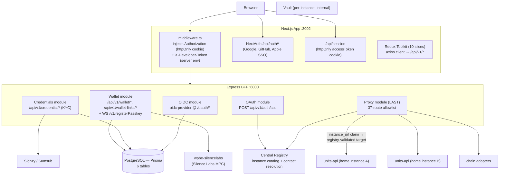

# finternet-app — Frontend + BFF Server

**Path:** `finternet-app/` · **Stack:** pnpm 9.15 + Turborepo, Node ≥ 20 (pnpm enforced via `only-allow`)
**Apps:** Next.js 15 App Router UI (`:3002`) + Express 4 BFF (`:6000`)

## Purpose

The user-facing web application plus its **Backend-for-Frontend (BFF)**. The Next.js app never talks to units-api directly — it calls relative `/api/*` paths, which Next.js rewrites to the Express BFF. The BFF handles OIDC ("Login with Finternet" provider), OAuth SSO, MPC wallet, KYC credentials, and forwards an **explicit allowlist** of routes to units-api and other targets.

> **Key architectural fact:** there is **no static units-api target and no `/api/v1/*` wildcard proxy** anymore. Every account-bound request resolves its upstream **per request** from the caller's JWT `instance_url` claim, validated against the central registry's instance catalog (federated multi-instance model). The proxy forwards only 37 explicitly-declared routes from `config/defaults.yaml` (`proxy.allowlist`); a malformed allowlist makes the server refuse to boot (`process.exit(1)`).

## Block Diagram

## Monorepo Layout

**Apps (2):** `@finternet/app` (Next.js UI) · `@finternet/server` (Express BFF)

**Packages (8):**

| Package | Purpose |
|---|---|
| `@finternet/config` | YAML config loader singleton (`config/defaults.yaml` + git-ignored `overrides.yaml`, deep-merged; arrays replace) |
| `@finternet/types` | Shared types incl. `AppConfig`, `ProxyAllowlistEntry`, JWT claims |
| `@finternet/logger` | Winston wrapper + `apiIdMiddleware` (tags requests with `api.id`) |
| `@finternet/validators` | Zod schemas |
| `@finternet/registry` | Awilix-backed generic provider DI container |
| `@finternet/instance-routing` | **Federation routing primitives** — JWT `instance_url` decode + registry-catalog validation + contact/instance resolvers |
| `@finternet/wallet-appkit` | Reown AppKit provider, wallet context, chain registry API |
| `@finternet/eslint-config` | Shared ESLint preset |

**Modules (6):** `oidc`, `credentials`, `oauth`, `wallet`, `proxy`, `db` (Prisma only, no routes). Registration order is load-bearing: **OIDC → Credentials → OAuth → Wallet → Proxy (must be last)** — OIDC installs `express-session` globally, and proxy paths must not shadow module routes.

## Express BFF Routes

### Health
| Method | Path | Notes |
|---|---|---|
| GET | `/health` | Status + `targets: { vault }` (no `account` target — there is no static units-api) |

### OIDC module — "Login with Finternet" provider
| Method | Path | Purpose |
|---|---|---|
| GET | `/oauth/interaction/:uid` | Fetch interaction state (login vs consent) |
| POST | `/oauth/interaction/:uid/login` | Complete login after OTP/Google SSO |
| POST | `/oauth/interaction/:uid/consent` | User approves scope sharing |
| POST | `/oauth/interaction/:uid/abort` | User denies |
| POST | `/api/oidc/clients` | Register an OIDC client (needs `context.developerToken`) |
| * | `/oauth/*` | `oidc-provider` mount: `/authorize`, `/token`, `/userinfo`, `/jwks`, `/introspection`, `/revocation` |

Built on `oidc-provider` v8. OIDC **clients** persist in Postgres; **sessions/tokens/grants are in-memory** (`Map`s, dev/test-grade adapter — no restart survival, no multi-replica sharing; the biggest known production gap). A custom middleware injects `finternet_access_token` (the user's units-api token) into the `/token` response so third-party clients get a usable API token. TTLs: access/id token 1h, auth code 10m, refresh 24h, session 24h.

### Credentials module (KYC) — `/api/v1/credential/*`
| Method | Path | Purpose |
|---|---|---|
| GET | `/api/v1/credential/providers` | List KYC providers |
| GET | `/api/v1/credential/journey/:journeyId/status` | Journey status |
| GET | `/api/v1/credential/journey/list` | List journeys for an address |
| POST | `/api/v1/credential/journey/initiate` | Start a journey |
| POST | `/api/v1/credential/journey/:journeyId/cancel` | Cancel |
| POST | `/api/v1/credential/callback/:provider` | Provider webhook (provider-specific auth headers, raw payload) |

Providers: **Signzy** and **Sumsub** via a registry factory. The journey stores `homeApiUrl` at init (while the user is authenticated) so the unauthenticated webhook can still mint the credential at the user's *home* units-api.

### OAuth module
| Method | Path | Purpose |
|---|---|---|
| POST | `/api/v1/auth/sso` | Verify Google `id_token` → mint short-lived authToken (signed with the **shared otp-service key**, ADR 0002) → resolve home instance via registry → login or return new-user token |

### Wallet module (providers from config: `silence-labs-network`, `appkit`)
| Method | Path | Purpose |
|---|---|---|
| GET | `/api/v1/wallet/status` | Wallet/passkey/MPC setup status |
| POST | `/api/v1/wallet/passkey` | Store passkey |
| PATCH | `/api/v1/wallet/passkey/:id` | Rename passkey |
| DELETE | `/api/v1/wallet/passkey/:id` | Delete passkey |
| POST | `/api/v1/wallet/create` | Create MPC wallet |
| POST | `/api/v1/wallet/sign` | Sign a transaction |
| POST | `/api/v1/wallet/sign-transfer` | Sign a transfer |
| POST | `/api/v1/wallet/finternet-identity/sign` | Sign with federation identity key |
| POST | `/api/v1/wallet/finternet-identity/finalize` | Rebind pending pre-account keys to real address |
| WS | `/v1/registerPasskey` | WebSocket proxy to wpbe-silencelabs (HTTP `upgrade` handler) |
| GET | `/api/v1/wallet-links` | List linked external wallets (AppKit) |
| POST | `/api/v1/wallet-links` | Link a wallet (CAIP-10) |
| DELETE | `/api/v1/wallet-links/:id` | Unlink |

### Proxy module — the 37-route allowlist

Targets: `account` (federation-routed), `chainAdapter` (static base URL; `POST /api/v1/chain-adapter/*` is the one surviving wildcard), `registry` (static, dev-token injected server-side), `vault` (special-cased `forwardVault()` using the **user JWT** exchanged for a user-scoped Vault token — currently no vault entries; PII decrypt routes to home units-api instead).

- **26 authenticated account routes** with `[enrichContext, instanceUrlTarget]`: `account/get|logout|update|sign|pii/decrypt`, `account/keys/register`, `terms/accept`, `token/search|transactions|transact|add`, `transaction/get|search`, `registry/chains/search`, `scopes/search`, `scopes/apis/search`, `clients/*` (8 routes), `scope-approvals`, `workflows/execute`.
- **Signup/login chains:** `account/login` `[enrichContext, signupInstanceTarget, contactTarget]`, `account/create` + `address/checkAvailability` `[enrichContext, signupInstanceTarget]`, `terms/get` `[enrichContext, signupInstanceTarget, instanceUrlTarget]`.
- **6 registry routes:** `GET /instances`, `GET /.well-known/registrar-pubkey`, `GET /names/:name`, `POST /registry/resolve`, `POST /resolve`, `POST /registry/account/login`.

Forwarding details: session/OIDC **cookies are stripped** before proxying; the JSON body is re-streamed via a fresh `Readable` (express.json already consumed the stream); the `account` target is seeded with an invalid placeholder URL and returns **401 fail-closed** if no federation target was resolved.

### Federation routing (`@finternet/instance-routing`)

Trust model (ADR 0001): *the BFF is a router, not an authenticator* — it decodes the JWT `instance_url` claim **without signature verification**, then exact-matches it against the registry's instance catalog (the allowlist is the SSRF guard). Resolvers (all 5-min TTL caches): contact→home (`POST /v1/resolve`, negatives uncached), instance-UUID→URL (signup-gated and ungated variants), instance-URL→URL. Middlewares fail closed: `instanceUrlTarget` → 401 `FED_INSTANCE_UNRESOLVED`; `signupInstanceTarget` (reads `payload.homeInstance` UUID, deletes it from the forwarded body) → 400; `contactTarget` (classifies email/phone from `payload.username`) → 400. Known accepted gap: the KYC-mint path authenticates with the BFF dev-token, so the catalog allowlist is the only identity gate there (JWKS verification deferred).

## Database — Prisma (6 models)

Schema at `modules/db/prisma/schema.prisma` (PostgreSQL). ⚠️ No `migrations/` directory — the same DDL is duplicated as hand-written SQL in `manifests/specs/db/*.sql` (drift risk).

| Table | Purpose | Key fields |
|---|---|---|
| `oidc_clients` | OIDC client registrations | `client_id` (unique), `client_secret`, `redirect_uris[]`, `grant_types[]`, `response_types[]`, `scope`, `token_endpoint_auth_method`, `client_name?` |
| `provider_journeys` | KYC journey state | `address`, `provider_id/key/name`, `journey_id`, `journey_url?`, `status`, `document_type?`, `transaction_id?`, **`home_api_url?`** (captured at init for the unauthenticated webhook), `started/completed/expires_at` |
| `integration_providers` | KYC provider configs | `provider_key`, `provider_name`, `provider_type`, `flow_id`, `country?`, `config` (JSON), `credentials` (JSON), `features?`, `status`; unique `(provider_key, flow_id)` |
| `user_wallet_links` | External wallets linked via AppKit | `address`, `namespace` (`eip155`/`solana`), `wallet_address`, `address_normalized`, `caip_address` (required for uniqueness), `is_evm`; unique `(address, namespace, address_normalized, caip_address)` |
| `user_passkeys` | WebAuthn passkeys (many per user) | `address` (non-unique), `credential_id` (unique), `display_name?`; has-many `user_mpc_keys` |
| `user_mpc_keys` | Silence Labs MPC key metadata | `address`, `passkey_id` (FK), `key_id`, `wallet_address`, `sign_alg`, `purpose` (`chain:ethereum` \| `chain:solana` \| `finternet:identity`), `public_key`, `threshold`, `total_parties`, `status`, `is_primary`; unique `(address, key_id)` **and** `(address, sign_alg, purpose)` |

The `(address, sign_alg, purpose)` uniqueness lets the federation-identity ed25519 key coexist with the Solana chain ed25519 key.

## Next.js App

### Config bridging
`next.config.ts` loads the YAML config at config-evaluation time and bridges values into `process.env` (not the `env:` block — webpack would inline empty build-time values). No `UNITS_API_URL` exists: the frontend only ever calls relative `/api/*`. Runtime config reaches the browser as `window.__RUNTIME_CONFIG__` injected in `layout.tsx` (`force-dynamic`).

### Rewrites (order matters)
1. `/api/auth/:path*` → itself (NextAuth shielded)
2. `/api/session` → itself
3. `/api/:path*` → BFF `:6000`
4. `/credential/:path*` → BFF

### `middleware.ts` — three jobs
1. **Credential injection:** for `/api/*`, injects `Authorization: Bearer <accessToken>` from the httpOnly cookie + `X-Developer-Token` from server env — **neither credential ever reaches the browser**.
2. Auth-route guard (`/login`, `/otp` → `/profile` if authenticated; GET only).
3. Protected-route guard (dashboard routes → `/login` if no live, non-expired token).

### Pages (App Router)
- **Auth group:** `/login`, `/otp`, `/create-account` (address + home-instance pick)
- **Dashboard group:** `/dashboard`, `/profile`, `/tokens`, `/tokens/details`, `/tokens/credential-details`, `/transactions`, `/transactions/details`, `/transfer/[tokenId]`, `/transfer/onchain`, `/add-credentials`, `/credential-callback`, `/kyc/sumsub`, `/clients` (+ `register`, `edit`, `details`, `approvals`)
- **Other:** `/`, `/consent/[uid]` (OIDC consent), `/auth/callback`, `/logout`
- **Route handlers:** `/api/auth/[...nextauth]`, `/api/session` (GET/POST/DELETE httpOnly cookie management), `/api/health`

### State — Redux Toolkit (10 slices)
`auth`, `tokens`, `transactions`, `oidc`, `wallet`, `clients`, `scopeApprovals`, `appConfig`, `instance` (federation instance catalog), `federation` (DID, identity key, home, key references). All server data flows through `createAsyncThunk` — **React Query is vestigial** (provider exists only because wagmi/Reown AppKit require it; no custom query hooks). Client secrets from register/rotate responses are deliberately never stored in Redux (shown once in a dialog, then dropped).

### API client
`axios` with baseURL `/api/v1`, 30s timeout, `axios-retry` (3× exponential on network/5xx). Response interceptor: 403 → toast, never logout; 401 → probe `GET /api/session` (3s race) and only log out if the token is genuinely expired/absent; ≥500 → friendly-message toast. Envelope built client-side via `createApiContext` (`{ id, version, ts, msgId }`); the BFF's `enrichContext` fills gaps (incl. `developerToken`).

### NextAuth
Google/Apple/GitHub providers registered conditionally (only if creds present). JWT strategy. The `jwt` callback exchanges the provider `id_token` at the BFF `POST /api/v1/auth/sso`; new users retain `ssoIdToken` to re-run SSO after federated signup commits. Uses `node:http` instead of `fetch` because undici blocks port 6000 (X11 port).

### Wallet stack
Reown AppKit + wagmi/viem (EVM), `@solana/web3.js` (Solana), `@silencelaboratories/walletprovider-sdk` (MPC). KYC UI: `@sumsub/websdk-react`.

## Observability

OTel via HyperDX (initialized before any Express import). Every route tagged with an `api.id` (e.g. `api.proxy.units`, `api.wallet.sign`). Structured snake_case logging (`server_started`, `authtoken_minted`, `proxy_instance_url_unresolved`).

## Known Gaps / Doc-worthy Caveats

1. **OIDC sessions/tokens/grants are in-memory** — dev-grade adapter; no restart survival or replica sharing.
2. **No Prisma migrations dir** — `schema.prisma` and `manifests/specs/db/*.sql` are dual sources of truth.
3. **BFF never verifies JWT signatures** (ADR 0001 — router, not authenticator); KYC-mint path is the accepted gap.
4. **Dev-token verification is off by default** (`features.enableDevTokenVerification: false`) — `authenticateDeveloper()` is a no-op on KYC routes in practice.
5. **`/workflows/execute` through the BFF is intentionally broad** — units-api owns authz for any `{workflow, action}` pair.

## Key Files

- BFF bootstrap: `apps/server/src/{server,app}.ts`, `apps/server/src/modules/index.ts`
- Allowlist: `config/defaults.yaml` (`proxy.allowlist`), `modules/proxy/src/routes/*`
- Forwarding: `modules/proxy/src/services/proxy.service.ts`
- Federation: `packages/instance-routing/src/*`, `modules/proxy/src/middlewares/*`
- Prisma: `modules/db/prisma/schema.prisma`
- ADRs: `docs/adr/0001-bff-instance-routing-trust-model.md`, `0002-bff-shared-otp-signing-key.md`
