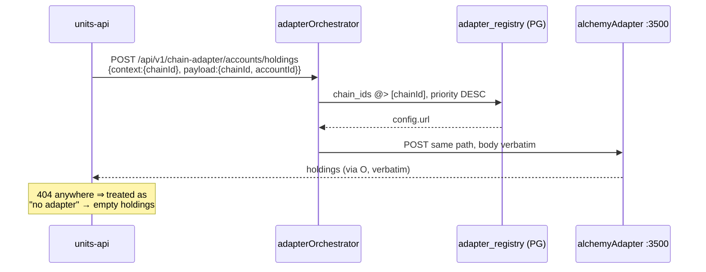
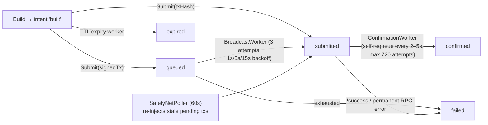

# units-services · units-adapters

## units-services — Supporting Services

**Path:** `units-services/` — **four** services (the sub-project CLAUDE.md omits `registry`, the largest one; there is no `policy-evaluator`).

| Service | Language | Purpose | Port(s) |
|---|---|---|---|
| `notificationService` | Node.js / Express | OTP generate + verify, mints the OTP JWT | **4000** (compose + all consumers) / 3000 (code default + Helm) |
| `adapterOrchestrator` | Go / Fiber | Chain-adapter routing proxy (`context.chainId` → adapter URL) | 8090 (Helm; no code default) |
| `proofService` | Rust / Axum | BLAKE3 Merkle batch prover (background worker) | 8081 (Docker/Helm) |
| `registry` | Go / Fiber ×2 | **Central federation registrar** — account directory, instance capabilities, developer credentials, Keycloak M2M mirror | 3000 public / 3001 admin / 9090 metrics |

---

### notificationService — OTP + JWT issuer

**No database** — mock OTP codes live in an in-process Map (mock mode is single-replica-only).

| Method | Path | Description |
|---|---|---|
| GET | `/health` | Liveness |
| GET | `/.well-known/ulip.json` | JWKS-style doc derived from the configured private key at request time; **what units-api and the registry fetch to verify OTP JWTs** (`key_id` = `<issuer>-key-1`, 1h cache) |
| POST | `/api/v1/otp/generate` | Send OTP — `{recipient, channel?}`, channel ∈ sms/call/email/whatsapp (default derived from `@`) |
| POST | `/api/v1/otp/verify` | Verify + **mint the JWT** — `{recipient, code (6 digits, always required), challenge?}` → `{jwt:{token, expiresIn, tokenType, issuer}}`; 401 `OTP_EXPIRED` / 400 `OTP_INVALID` |

**JWT:** default **EdDSA (Ed25519)** (not RS256 as older docs claim), implemented on Node native `crypto`. Claims: `{username, channel, authMethod:"otp", otp, typ:"Bearer", iss, iat, exp}` + optional `challenge` (verbatim claim for the MPC auth path — the old `authToken` pass-through is gone). `verifyJWS` pins the expected algorithm from the verifier (no alg-confusion). Startup cross-validates key type vs `JWT_ALGORITHM`.

**Integrations:** Twilio Verify v2 (gated on `TWILIO_ENABLED`, rich error mapping to 400/429/500/503); SendGrid (delivers the mock OTP email only); HyperDX OTel. Mock mode: fixed `123456` when `MOCK_OTP_ENABLED`, sms rejected unless `OTP_EMAIL_OVERRIDE_ENABLED`.

**Key env:** `JWT_PRIVATE_KEY` (required — refuses to start without it), `JWT_ISSUER` (`otp-service`), `JWT_EXPIRY_SECONDS` (3600), `JWT_ALGORITHM` (`EdDSA`|`RS256`), `TWILIO_*`, `SENDGRID_*`, `PORT`.

---

### adapterOrchestrator — chain-adapter routing proxy

Two routes: `GET /health` and **`POST /*`** (catch-all). Reads `context.chainId` from the body, resolves the adapter from `adapter_registry` (owned by units-api):

```sql
SELECT * FROM adapter_registry
WHERE chain_ids @> ARRAY[$chainId]::text[] AND type='chain' AND active=true
ORDER BY priority DESC, id ASC LIMIT 1
```

then forwards `POST {config->>'url'}{originalPath}` verbatim (path preserved — the orchestrator only substitutes the host). Missing chainId → 400; **any other failure (DB outage, bad URL, TCP error) collapses to 404** — units-api depends on this (404 = "no adapter for this chain, skip gracefully"), so infra faults are indistinguishable from unsupported chains. HTTP client has no timeout. Config: `APP_CONFIG` JSON (all fields required, no port default), `DB_PROVIDER`/`DB_CONFIG`. No auth/CORS/OTel middleware.

**Discovery flow:**



Both `context.chainId` (orchestrator reads) and `payload.chainId` (adapter reads) must be set — units-api duplicates it deliberately. Seed: one row `alchemy_chain_adapter`, priority 1, all 31 CAIP-2 chain IDs, URL → the adapter's cluster service `:3500`.

---

### proofService — Merkle batch prover

**One endpoint:** `GET /v1/health`. The proof *read* API (`/v1/transaction/proof[/leaf|/verify]`) lives in **units-api**, which reads the JSONB `proof_data` this service writes (that's why per-leaf `proofPath` is persisted).

**Background generator:** infinite loop; one DB transaction spans read → hash → write. Selects `transactions WHERE proof_id IS NULL AND status='completed' … LIMIT batch_size FOR UPDATE`, loads their `token_transactions`, builds a **BLAKE3 Merkle tree** (leaf = `blake3(compact canonical JSON)` with sorted keys and microsecond-normalized timestamps; odd nodes promoted, not duplicated), writes a `proofs` row (`proof_profile='merkle-tree'`, root hex without `0x`, `status='proven'`), stamps `proof_id` back on both tables (by PK, with rows-affected assertions).

**Caveats:** batches are **exactly `MERKLE_BATCH_SIZE`** — partial batches are never proven, no time-based flush (low-traffic env with batch 100 ⇒ no proofs). No `SKIP LOCKED` (single replica). **Blockchain anchoring is not implemented** — `ledger_anchors` always NULL, status never advances past `proven`; schema is ready for a future worker. All env vars mandatory (`DATABASE_URL`, `MERKLE_BATCH_SIZE`, `MERKLE_POLL_INTERVAL_SECS`, `API_PORT`, `HEALTH_PORT` — the last is parsed but dead).

---

### registry — central federation registrar

The authority for federation names (`address → DID → home_instance`, JWS-signed by the registrar), instance capabilities, developer credentials/scopes/delegations, and a Keycloak M2M mirror. **Its own database** (`units_registry`, 12 tables, own DDL V01–V10) — entirely separate from units-api's. ~48 routes across three listeners:

**Public :3000 (unauthenticated):** `GET /health`, `/ready`, `/v1/.well-known/registrar-pubkey` (TOFU trust anchor), `/.well-known/ulip.json` (registrar + mirrored OTP-issuer keys); `POST /v1/account/login` (OTP login → home instance or instance catalog), `POST /v1/account/create` (90s name reservation gated on verified OTP-JWT), `POST /ulip/v1/info`.

**ULIP envelope-authenticated:**
- Name/capability: `POST /ulip/v1/name/register|resolve`, `/accounts/get|update`, `/capabilities`
- Credential reads (always live, no dedup — near-immediate revocation): `credential/resolve`, `scope/catalog`, `ratelimit/catalog`, `delegation/fetch`, `client/list|get`, `key/list`, `delegation/list|get`
- Owner-signed mutations (inner owner envelope + `request_log` dedup + audit): `client/register|update|deactivate|reactivate`, `client/secret/rotate`, `client/scopes/update`, `key/create|revoke`, `scope/request`, `delegation/create`
- Instance-authorized mutations (act-only-if-pending row locks): `delegation/request|approve|reject|revoke`, `scope/approve|reject`

**REST mirror `/v1`** gated by `X-Developer-Token` (⚠️ empty `REGISTRY_DEV_TOKEN` **fails open**): `GET /v1/names/:name`, `/v1/accounts/:did`, `POST /v1/resolve` (email/phone → home; minimal-disclosure body), `GET /v1/instances`, `/v1/instances/:id`, `/v1/instances/:id/public-key`.

**Admin :3001** gated by `X-Admin-Token` (empty **fails closed**): capability PUT, name migration. **Metrics :9090** — Prometheus.

Tables: `accounts` (address PK = SHA-256 hash of plaintext; email/phone columns hold **hashes**), `registered_instances`, `public_key_registry` (homonym of units-api's, different DB), `request_log`, `audit_log`, `developer_clients`, `developer_keys`, `scopes`, `scope_apis`, `delegations`, `rate_limit_tiers`, `rate_limit_rules`.

Integrations: notificationService (OTP proxy + key mirror), central Keycloak `finternet-m2m` realm (sole KC-admin surface in the federation), DNS publishers (only `NoopPublisher` implemented). DIDs: `did:units:0x<hex(ed25519 pubkey)>`. A legacy wallet signing-input fallback in `envelope.Verify` is **load-bearing** (pinned by test — removing it breaks federation signup).

---

## units-adapters — Chain Adapter (alchemyAdapter)

**Path:** `units-adapters/chain/alchemyAdapter` · **Stack:** Go, Fiber, GORM, kafka-go, solana-go, uber/dig
**Port:** in-code default **8080**; 3500 imposed by env/Helm everywhere · **Base path:** `/api/v1/chain-adapter` (no `:chainId` path param — chainId travels in the body)

### The `ChainAdapter` interface (11 methods)

```go
type ChainAdapter interface {
    GetChainInfo(ctx) (*ChainInfo, error)          // static metadata, no RPC
    GetCapabilities(ctx) (*ChainCapabilities, error) // static flags + asset types
    GetHead(ctx) (*ChainHead, error)
    GetBlock(ctx, blockID) (*BlockInfo, error)
    GetAccount(ctx, accountID) (*AccountInfo, error)   // native balance + nonce
    GetHoldings(ctx, accountID) (*HoldingsResponse, error) // native + all tokens; reads EnrichKey from ctx
    GetAsset(ctx, assetID) (*AssetInfo, error)
    BuildTransaction(ctx, req) (*TransactionBuildResponse, error) // unsigned payload + signing mode
    SubmitRawTransaction(ctx, signedTx) (string, error)
    GetTransaction(ctx, txID) (*TransactionInfo, error)
    GetReceipt(ctx, txID) (*TransactionReceipt, error)
}
```

Two implementations (fully independent, no base struct):

| Concern | EVMAdapter | SolanaAdapter |
|---|---|---|
| Signing mode | `signTransaction` | `signAndSendTransaction` |
| Tx payload | hex-field JSON map | `{transaction: <base64>}` |
| Token metadata | Alchemy RPC (`alchemy_getTokenMetadata`), 10-slot worker pool + cache | off-chain token list URL, serial |
| Asset IDs | `native`, `erc20:<a>`, `erc721:<a>`, `erc1155:<a>` | `native`, `spl:<mint>` |
| Extra | legacy gasPrice only (no EIP-1559); fee pref ×0.9/×1.0/×1.2 | probes destination ATA, prepends create-ATA |

### Chains — 31, registered under two keys each
Every chain is inserted under both its Alchemy ID (`ethereum-mainnet`) and CAIP-2 (`eip155:1`). 19 EVM mainnets, 10 EVM testnets, 2 Solana. One `ALCHEMY_API_KEY` for all chains. ⚠️ `evmChainMetaMap` has only 4 entries (ethereum/base × mainnet/sepolia) — the other 25 EVM chains fall back to `{ETH, 18, 12}` and get **no `chainId` in built transactions (no EIP-155 replay protection)**; the registry seeds CAIP-2 keys, which is also the form the confirmation-delay map misses.

### Routes (13)

| Method | Path | Purpose |
|---|---|---|
| GET | `/health`, `/docs/*` | Liveness, Swagger (stale) |
| POST | `/api/v1/chain-adapter/chain/info` \| `/capabilities` \| `/head` \| `/block` | Chain metadata/head/block |
| POST | `.../accounts/get` | Native balance + nonce |
| POST | `.../accounts/holdings` | All holdings (`enrich` defaults true) |
| POST | `.../balance/get` | Single-token balance — implemented as a full holdings scan + substring match |
| POST | `.../assets/get` | Token/NFT/native metadata |
| POST | `.../transactions/build` | Build unsigned tx + **persist an intent** → `{intentId, txPayload, signingMode, expiresAt}` |
| POST | `.../transactions/submit` | `{intentId, signedTx?}` (async broadcast) or `{intentId, txHash?}` (client already broadcast) |
| POST | `.../transactions/get` \| `/status` (alias) \| `/receipt` | Live on-chain lookups (never read the local DB) |

Envelope: request `{context, payload}`; success always HTTP 200 `{context:{status:"successful"}, response}`. **`developerToken`/`authorization` are parsed but never read — no auth anywhere in this service.** Rate limit 200 req/min per IP per replica. Chain resolution: body `payload.chainId` → `X-Chain-ID` header → `?chainId=` query (middleware result is unused — services re-resolve).

### Database (2 tables, DDL in `migrations/001_init.up.sql`, applied externally)

**`chain_adapter_intents`** — `id` (`intent_<uuid>`) PK, `chain_id`, `from_address`, `to_address`, `asset` (default `native`), `amount` (TEXT), `fee_preference`, `tx_payload` JSONB, `signing_mode`, `status` (`built → queued → submitted → confirmed|failed|expired`), `tx_hash`, `signed_tx`, `error`, `broadcast_attempts`, `expires_at`.

**`chain_adapter_transactions`** — `tx_hash` PK, `intent_id` FK, `chain_id`, `status` (`pending → confirmed|failed`), `block_number/hash`, `confirmations` (⚠️ never updated — always 0), `gas_used`, `effective_gas_price`, `success`, `logs` JSONB, `first_seen_at`, `confirmed_at`.

### Kafka topics + workers

| Topic | Produced by | Consumed by |
|---|---|---|
| `finternet.transactions.submit` | Submit (signedTx path) | **BroadcastWorker** |
| `finternet.transactions.confirm` | Submit (txHash), BroadcastWorker, ConfirmationWorker (self-requeue), SafetyNetPoller | **ConfirmationWorker** |
| `finternet.transactions.status` | both workers | downstream/external |
| `finternet.transactions.dlq` | both workers | — |

Messages keyed by `ChainID` (per-chain ordering). Consumers commit even on handler error (handler owns retries/DLQ).



Four workers launched as bare goroutines (no WaitGroup — shutdown doesn't drain): **BroadcastWorker** (Kafka-driven; blocking backoff can stall a partition ~21s), **ConfirmationWorker** (self-requeue polling, per-chain delay 2s Solana / 5s EVM, DLQ at 720 attempts or permanent RPC error), **SafetyNetPoller** (60s; resets attempt budgets — an unmineable tx resurfaces forever), **IntentExpiry** (30s; sweeps only `built`, so an intent stuck in `queued` after a failed Kafka publish is never swept).

**Key env:** `DATABASE_URL` + `ALCHEMY_API_KEY` (required), `PORT` (8080 default), `KAFKA_BROKERS`, `INTENT_TTL_EVM` (5m) / `_SOLANA` (60s), `CONFIRM_MAX_ATTEMPTS` (720), `CONFIRM_CHECK_DELAY_*`, `SAFETY_NET_*`, `SOLANA_TOKEN_LIST_URL` (empty default ⇒ SPL enrichment off; Helm sets Jupiter list). Helm prod: YugabyteDB + Strimzi Kafka.

## Documentation Drift Worth Knowing

1. `units-services/CLAUDE.md` omits the registry service; notificationService is EdDSA (not RS256) and no longer accepts `authToken` on verify.
2. `units-adapters/CLAUDE.md` documents a nonexistent `:chainId` path-param route shape; the swagger is stale and unregenerable.
3. proofService is implemented (not spec-only), but anchoring is entirely absent.
4. `units-services/specs/db/registry.sql` is the **adapter_registry** DDL, not the registry service's schema (confusing collision).
5. notificationService port: code/Helm say 3000, compose and all consumers say 4000.
