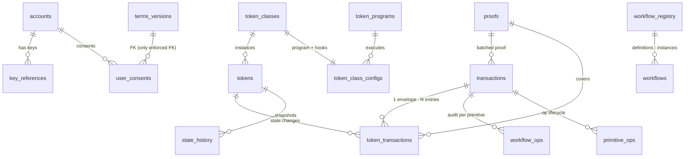

# Database Schemas

Canonical DDL for the platform PostgreSQL database lives in **`units-api/specs/db/V01__*.sql` … `V14__*.sql`**. The `V__` prefixes document apply order only — this is **not Flyway-managed**. V01–V09 + V12 are the clean-slate source of truth; V11/V14 are idempotent convergence scripts for already-provisioned databases. `make db-migrate` runs each file with `|| true`.

**21 tables are owned locally by units-api.** The Rust tokenEngine and proofService read/write the same database. The finternet-app BFF has its own 6 Prisma tables (documented at the end). `api_clients`, `scopes`, `delegations`, and rate-limit tables have **moved to the central registry service** and are no longer local.

## Entity-Relationship Overview

> Except for `user_consents.terms_version_id`, **no foreign keys are enforced** — relationships are by-convention (denormalized model).

---

## Identity & Keys

### `accounts` (V01)
Core identity table for all participants.

| Column | Type | Notes |
|---|---|---|
| `account_id` | UUID | **PK** (UUIDv7) |
| `address` | VARCHAR | **UNIQUE NOT NULL** — human address (e.g. `alice`) |
| `name` | VARCHAR | Legal/business name |
| `email` | VARCHAR | **SHA-256 hash** (lookup/uniqueness; masked value in `pii`) |
| `mobile` | VARCHAR | **SHA-256 hash** |
| `pii` | JSONB | `{email_masked, mobile_masked, email_encrypted: "vault:v1:…", mobile_encrypted}` |
| `vault_entity_id` | VARCHAR | Vault identity entity |
| `entity_type` | VARCHAR | individual / business |
| `did` | VARCHAR | **UNIQUE** — verifiable DID |
| `flags` | JSONB | `{isWhatsAppSendingAllowed, piiEncryptionEnabled, piiMaskingEnabled}` |
| `integrations` | JSONB | `[{provider:'KEYCLOAK', external_user_id, linked_at}]` |
| `contact_methods` | JSONB | `[{type:'EMAIL', value, verified, verified_at}]` |
| `account_status` | VARCHAR(32) | `active \| migrating \| frozen \| suspended` |
| `registry_version` | INT | DEFAULT 1 |
| `created_at`, `updated_at` | TIMESTAMPTZ | |

Dropped by V11: `migrated_from`, `migrated_at`, `home_instance` — an account's home is resolved from the central registry by DID. Keys live in `key_references` (no `public_key` column).

### `key_references` (V01, reshaped V11/V14)
**Single source of truth for all account keys** (mpc / vault_transit / external).

| Column | Type | Notes |
|---|---|---|
| `id` | UUID | **PK** |
| `account_id` | UUID | → accounts (no FK) |
| `key_type` | VARCHAR | `ed25519 \| secp256k1` |
| `name` | VARCHAR | Label: `units-signing-<accountID>` (vault_transit), passkey label (mpc), user label/NULL (external) |
| `public_key_hex` | VARCHAR | Nullable (address-only MetaMask rows); no `0x` |
| `address` | VARCHAR | NOT NULL — canonical chain address (0x EVM / base58 Solana). **The idempotency anchor**; DID derived on read |
| `status` | VARCHAR(32) | `active \| superseded \| revoked` |
| `superseded_by` | UUID | → key_references.id |
| `key_source` | VARCHAR(32) | `mpc \| vault_transit \| external` |
| `is_primary` | BOOLEAN | Primary receiving key per (account, key_type) — proxy-transfer recipient resolution |
| `is_default` | BOOLEAN | Default signing key per account |
| `registered_at`, `signed_envelope_id`, timestamps | | |

Partial UNIQUE indexes (partial deliberately, so revoked rows never block re-registration):
- `(account_id, address) WHERE status='active'`
- `(account_id, key_type) WHERE is_primary`
- `(account_id) WHERE is_default`
- `(name) WHERE key_source='vault_transit'`

V14 dropped the *global* active-address uniqueness: the same on-chain address may now be active on multiple accounts; `/registry/lookup-address` remains deterministic by picking the oldest active row.

---

## Token Domain

### `token_classes` (V02)

| Column | Type | Notes |
|---|---|---|
| `id` | UUID | **PK** (UUIDv7) |
| `token_class` | VARCHAR | **UNIQUE** (e.g. `USDC`) |
| `token_standard` | VARCHAR | `UNITS-FT`, `ERC-3643`, `ERC-20`, `UNITS-NFT`, `ERC-721`, … |
| `name` / `description` | VARCHAR / TEXT | |
| `schema` | JSONB | JSON Schema validating token instances |
| `identities` | JSONB | Authorized minters `[{id, type:"issuer"}]` |
| `metadata` | JSONB | `{decimals, symbol, …}` |
| `chain_deployments` | JSONB | `[{chainId, contractAddress, assetType, decimals}]` — proxy-token import filtering |
| `status` | VARCHAR | active / deprecated / suspended |

**Balance model is derived from `token_standard`**, not configurable: FT standards → per-owner balances (transfer = debit sender + credit recipient); NFT standards → unique token, transfer changes ownership.

### `tokens` (V02)
One row per token instance (e.g. Alice's 100 USDC).

| Column | Type | Notes |
|---|---|---|
| `id` | UUID | **PK** (UUIDv7) |
| `token_class_id` / `token_class` / `token_standard` | UUID / VARCHAR | Denormalized to avoid JOINs |
| `identities` | JSONB | **All** relationships (issuer, owner, creator, custodian). Owner = entry with `type:"owner"` |
| `relationships` | JSONB | Verifiable claims / dependent tokens `[{type:"KYC", issuer, value}]` |
| `data` | JSONB | Token data validated against class schema |
| `state` | JSONB | `{status, supply:{totalSupply, circulatingSupply}}` |
| `protected` | JSONB | Vault-encrypted copies keyed by column name |
| `state_commitment` | VARCHAR | Current commitment hash |
| `last_tx_id` | VARCHAR | Feeds the commitment chain |
| `state_version` | INTEGER | **Optimistic locking** |
| `chain_id` | VARCHAR | CAIP-2; NULL = native, NOT NULL ⇒ **proxy token** |
| `contract_id` | VARCHAR | Source-chain contract or `"native"` |
| `wallet_address` | VARCHAR | On-chain holder address (required for proxy tokens) |
| `tags` / `metadata` | JSONB | |

Key constraint: `uq_tokens_proxy` UNIQUE on `((identities #>> '{0,0,id}' owner), chain_id, contract_id, wallet_address) WHERE chain_id IS NOT NULL` — no duplicate proxy tokens per owner + on-chain balance.

### `token_class_configs` (V03)
Maps a class to its executing program + hooks.

| Column | Notes |
|---|---|
| `token_class` | **UNIQUE** → token_classes |
| `program_id` | → token_programs.program_id |
| `pre_hooks` / `post_hooks` | `[{hookId, priority, enabled, operations}]` — lower priority runs earlier; `operations: null` = all ops |
| `operation_overrides` | `{mint:{requireApproval}, transfer:{maxUnits}}` |
| `config` | `{enableStateHistory, stateCommitmentAlgorithm:"sha256"}` |
| `identities` | Empty array = defer to `token_classes.identities`; non-empty = authoritative override |
| `status` | active / inactive / suspended |

### `token_programs` (V03)

| Column | Notes |
|---|---|
| `program_id` | **UNIQUE** (e.g. `"fungible"`) |
| `name`, `description`, `version` | |
| `supported_standards` | `["UNITS-FT","ERC-3643","ERC-20"]` |
| `supported_operations` | `["mint","burn","transfer","freeze","unfreeze","lock","unlock"]` |
| `config` | Includes **`config.plans`** — program self-declared saga plan, preferred over built-in recipes |
| `identities` | ACL; caller stamped as owner at register |
| `status` | active / deprecated / disabled |

---

## Transactions & Proofs

### `transactions` (V02)
Async transaction envelope.

| Column | Type | Notes |
|---|---|---|
| `id` | UUID | **PK** (UUIDv7) |
| `correlation_id` | VARCHAR | External correlation |
| `initiator` | VARCHAR | Initiator DID |
| `identities` | JSONB | Envelope-level identity snapshot |
| `workflow_instance_id` | VARCHAR | Workflow URN |
| `status` | VARCHAR | pending / processing / awaiting_signature / completed / failed / cancelled |
| `status_v2` | VARCHAR(32) | Federation lifecycle (DEFAULT `'submitted'`; also declared by engine migration `002_lifecycle_states.sql`) |
| `error` | JSONB | `{code, message}` |
| `timestamps` | JSONB | `{submitted, started, completed, finalized}` |
| `proof_id` | UUID | → proofs; NULL = awaiting proof |
| `proof_profile`, `batch_id` | VARCHAR | |
| `response_data` | JSONB | Proxy transfers: `{unsignedTx, chainId, expiresAt}` → `{chainTxHash, blockNumber}` |
| `initiator_instance` / `counterparty_instance` | VARCHAR(255) | Federation |
| `reverses_txn` | VARCHAR(255) | Compensation link |
| `plan_data` | JSONB | The saga plan as one projection: `{templateName, templateVersion, operationName, planHash, assetSelectorHash, steps, participants}`. SOURCE writes at submit; DEST row marked `status_v2='inbound'` |

### `token_transactions` (V02)
Per-token state change; one transaction → many rows. **Double-entry bookkeeping.**

| Column | Notes |
|---|---|
| `tx_id` | → transactions |
| `token_id` | → tokens |
| `token_class` | Denormalized |
| `operation` | mint / transfer / burn / lock / unlock / update |
| `entry_type` | **`'debit'` (sender) or `'credit'` (recipient)**, same tx_id; NULL for non-transfers |
| `identities` | **Immutable snapshot** of token-level roles at tx time (who *could* act) |
| `participants` | Transaction-level roles — `[{accountId, role}]` (who *actually* acted: sender/receiver/operator/approver) |
| `units` | `{value:"100000000", unit:"token", decimals:6}` — amounts as strings |
| `state_before` / `state_after` | `{stateCommitment, stateVersion, stateSnapshot}` |
| `protected` | Encrypted copies |
| `signature` | `{type:"Ed25519Signature2018", value, signer:"did:…#key-1"}` — non-repudiation |
| `proof_id`, `timestamp`, `metadata` | |

### `proofs` (V02)

| Column | Notes |
|---|---|
| `proof_profile` | zk-snark / merkle-tree |
| `proof_data` | `{root, witnesses, publicInputs}` |
| `state_commitment` | NOT NULL |
| `tx_ids` | JSONB array — one proof can batch many txs |
| `ledger_anchors` | `[{chain, network, txHash, blockId/slot, timestamp}]` — multi-chain anchoring |
| `status` | pending / proven / anchoring / anchored / failed |

### `state_history` (V02)
Immutable snapshots enabling point-in-time reconstruction. UNIQUE `(token_id, state_version)`.

| Column | Notes |
|---|---|
| `token_id`, `state_version`, `state_commitment` | |
| `state_snapshot` | JSONB readable snapshot |
| `previous_commitment` | **Enables commitment-chain verification** |
| `commitment_config` | `{stateCommitmentFields, stateCommitmentAlgorithm}` — re-verification survives config changes |
| `token_tx_id` | Causing token transaction |

> **Cross-service subtlety:** when `identities` is in `stateCommitmentFields`, entries of delegation-managed types (currently `["access"]`) are **filtered out before hashing** — so a delegation grant/revoke doesn't invalidate prior commitments. This set is duplicated in Rust (`tokenPrograms/programs/core::DELEGATION_MANAGED_IDENTITY_TYPES`), TypeScript (`units-workflows/packages/db/src/reconcile.ts::MANAGED_TYPES`), and the SQL comment — all three must stay in sync. Similarly `TokenRepository.UpdateIdentities` never touches `updated_at`, or the recomputed commitment would drift and trip `data_integrity_violation`.

### `audit_events` (V02)
Append-only administrative audit (no UPDATE/DELETE): `event_type` (`TOKEN_CLASS_REGISTERED`, `TOKEN_MINTED`, `TOKEN_TRANSFERRED`, `IDENTITY_ADDED/REMOVED`, `ACL_UPDATED`, `STATUS_CHANGED`), `entity_type`/`entity_id`, `actor` (DID), `action`, `changes` (`{before, after, fields}`), `context` (`{ip, userAgent, sessionId}`), `timestamp`.

---

## Registries

### `chain_registry` (V04)
CAIP-2 network catalog: `network_id` (UNIQUE, e.g. `eip155:1`), `name`, `chain_family` (evm/solana/cosmos/substrate), `is_testnet`, `status` (ACTIVE/INACTIVE/DEPRECATED), `metadata` (`{iconUrl, explorers, nativeCurrency, blockTime}`), `supported_key_types` (`["secp256k1"]`/`["ed25519"]` — drives key-based chain discovery), `identities` (ACL).

### `wallet_provider_registry` (V04)
Wallet-app allow-list (policy for App Backends, not enforced by UNITS): `name`, `rdns` (UNIQUE, EIP-6963 e.g. `io.metamask`), `status` (ACTIVE/INACTIVE/BLOCKED), `supported_chains` (CAIP-2 JSONB), `metadata` (icon, deepLink, platforms), `identities`.

### `adapter_registry` (V04) — cross-service contract with adapterOrchestrator
One row per adapter **instance**: `adapter_id` (UNIQUE, e.g. `alchemy_chain_adapter`), `name`, `type` (default `chain`), `chain_ids` **TEXT[]** (GIN-indexed → `chain_ids @> ARRAY['eip155:1']`), `priority` (higher wins, ties by id), `active` (zero-downtime rotation), `config` JSONB (`{url required, apiKey, timeoutMs}`), `identities`. Multiple adapters may cover the same chain (priority failover).

### `workflow_registry` (V05)
Restate services self-register definitions on startup: `workflow_name` + `version` (UNIQUE pair), `description`, `config`, `steps` JSONB, `json_schema`, `restate_service`, `status` (active/deprecated/disabled), `identities`.

---

## Federation / Workflow Execution

### `workflows` (V06) — shared with units-workflows (Prisma reads/writes it)
`txn_id` VARCHAR **PK**, `workflow_name`, `status` (default pending), `payload` JSONB, `identities`, `caller_instance`, `initiator_account`, `outcome` JSONB, `retry_attempts`, `last_error`.

### `forwarding_pointers` (V07)
Post-migration forwarding: `did` **PK**, `new_home_id`, `installed_at`, `grace_until`, `signed_record` JSONB, `created_by`, `txn_id`.

### `workflow_ops` (V08)
Per-primitive audit row for every federation op (Lock, CreateIncoming, CommitDebit, CommitCredit, Reverse, …). **PK `(txn_id, op_seq)`**; `op_type`, `details`, `result`. Serves the audit list on `/v1/transactions/status`.

### `primitive_ops` (V09) — the saga backbone
Single row per `(txn_id, op_seq)` owning the entire op lifecycle. Replaced five earlier tables (idempotency logs + three outboxes). **Concurrency model: each column group has exactly one writer**, updated via targeted `UPDATE … WHERE (txn_id, op_seq)` — up to 6 concurrent writers across Go + Rust never clobber each other. The engine writes its groups **inside the same SQLx transaction as the token state mutation** → exactly-once execution.

| Group | Columns | Owner |
|---|---|---|
| Base | `txn_id`, `op_seq` (**PK pair**), `method`, `caller_instance`, `callee_instance`, `status`, `details`, `result`, timestamps | — |
| (A) Gateway HTTP dedup | `request_hash`, `admit_status`, `admit_response`, `admit_error` | gateway admit |
| (B) Command outbox → Kafka | `command_status/kafka_key/payload/attempts/next_at/error/sent_at` | gateway + command poller |
| (C) Engine dedup + execution | `engine_status`, `engine_result`, `engine_executed_at` | tokenEngine (in state tx) |
| (D) Completion outbox engine → source | `completion_status/target/payload/attempts/next_at/error/sent_at` | tokenEngine + completion poller |
| (E) Signal outbox source → Restate | `signal_status/name/workflow/workflow_id/payload/attempts/next_at/error/sent_at` | completion handler + signal poller (SOURCE only) |

Three partial indexes let each poller scan only its own pending rows (`WHERE <hop>_status IS NOT NULL AND <> 'sent'`).

---

## Terms & Consent (V12)

### `terms_versions`
Immutable after publish: `doc_type` (`terms_of_use`, `privacy_policy`), `version` (UNIQUE per doc_type), `version_label`, `content` (markdown), `content_hash` (SHA-256 — proves text unchanged), `status` (draft/published/archived), `requires_reconsent` (false = typo fix without forcing re-agreement), `effective_from`, `published_at`. V12 seeds two published versions.

### `user_consents`
Append-only: `account_id`, `doc_type`, `terms_version_id` (**the only enforced FK in the schema**), `content_hash` (copy at accept time), `consented_at`, `ip_address`, `user_agent`, `consent_method`.

---

## Registry-Side Tables (NOT local — central registry service)

GORM models remain in units-api purely as typed wire shapes for registry HTTP responses:

| Table | Key fields |
|---|---|
| `api_clients` | `name`, `scopes` JSONB, `allowed_operations` JSONB, `identities` (GIN), `rate_limit_tier_id`, `status` |
| `api_keys` | `client_id`, `key_hash` (SHA-256, unique, never plaintext), `status`, `expires_at`, `revoked_at` |
| `scopes` | `id` GENERATED ALWAYS AS `entity \|\| ':' \|\| scope`, `access_level` (default public) |
| `scope_apis` | `scope_key`, `api_id` |
| `delegations` | `grantor_address` / `grantee_address` (hashed), `label`, `permission`, `rule_type` (allow/deny), `status`, `expires_at`, `workflow_id`, `allowed_operations` JSONB (`{"tokens:transact": {"payload.operation": ["transfer"]}}`) |
| `rate_limit_tiers` / `rate_limit_rules` | `name`; `tier_id`, `scope_pattern`, `max_requests`, `window_seconds` |

Dropped tables: `primitive_templates` (recipes compiled into the binary), `public_key_registry` (backfilled into `key_references`), and the five outbox/idempotency tables consolidated into `primitive_ops`.

---

## finternet-app BFF Tables (Prisma, separate concerns)

Schema: `finternet-app/modules/db/prisma/schema.prisma` (duplicated as SQL in `manifests/specs/db/*.sql` — drift risk; no migrations directory).

| Table | Purpose | Key fields |
|---|---|---|
| `oidc_clients` | OIDC client registrations | `client_id` (unique), `client_secret`, `redirect_uris[]`, `grant_types[]`, `scope` |
| `provider_journeys` | KYC journey state | `address`, `provider_key`, `journey_id`, `status`, `home_api_url` (captured at init for the unauthenticated webhook) |
| `integration_providers` | KYC provider configs | `provider_key` + `flow_id` (unique pair), `config`/`credentials` JSON |
| `user_wallet_links` | AppKit-linked wallets | `address`, `namespace` (eip155/solana), `caip_address`; unique `(address, namespace, address_normalized, caip_address)` |
| `user_passkeys` | WebAuthn passkeys | `address` (many per user), `credential_id` (unique) |
| `user_mpc_keys` | Silence Labs MPC key metadata | `passkey_id` FK, `key_id`, `sign_alg`, `purpose` (`chain:ethereum`/`chain:solana`/`finternet:identity`), `threshold`, `total_parties`; unique `(address, key_id)` and `(address, sign_alg, purpose)` |
