# Diagrams — Finternet Platform

All diagrams in one place (mermaid). Per-service context lives in the numbered docs.

## 1. Platform Block Diagram

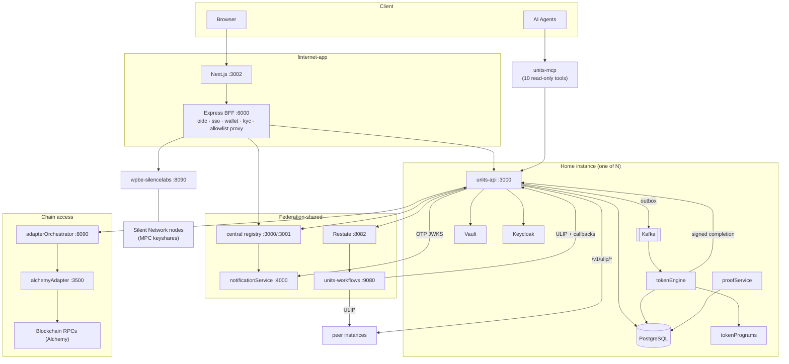

## 2. Cross-Instance Token Transfer (two-party prepare/commit saga)

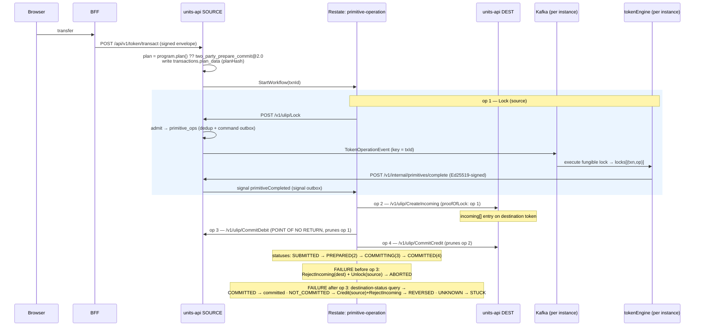

## 3. Engine Execution Pipeline (per Kafka message)

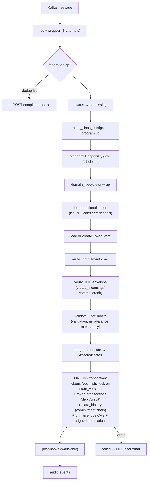

## 4. State Commitment Chain

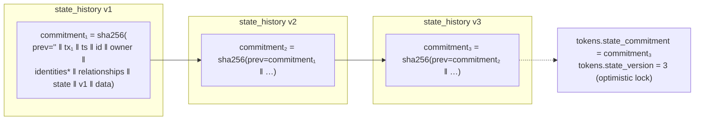

\* `identities` are filtered before hashing: delegation-managed types (`["access"]`) are excluded so grants/revokes don't invalidate prior commitments. Each `state_history` row stores the `commitment_config` used, so history stays verifiable after config changes.

## 5. Federation Routing at the BFF

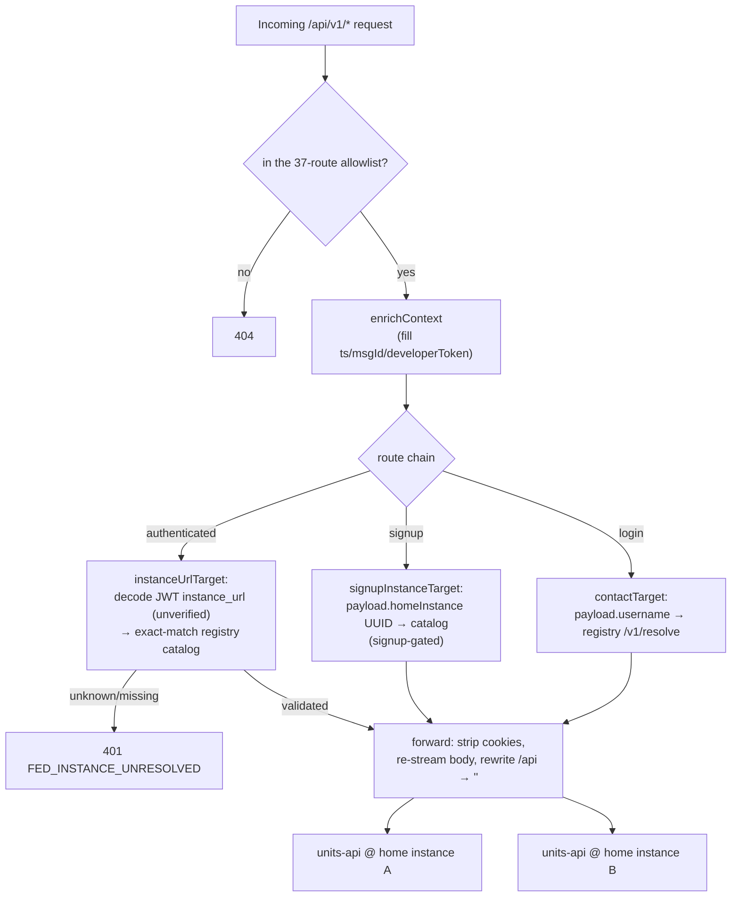

## 6. Auth & Login Flows

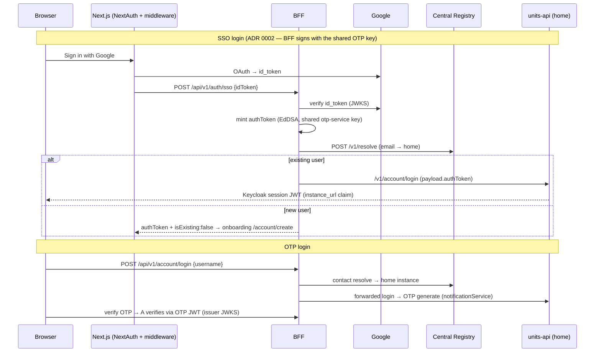

## 7. Two-Token Authorization Model (units-api)

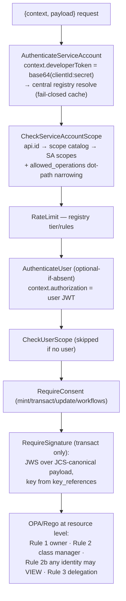

## 8. Chain Access Path

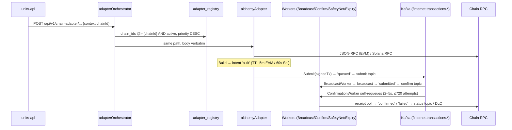

## 9. MPC Wallet Setup & Signing

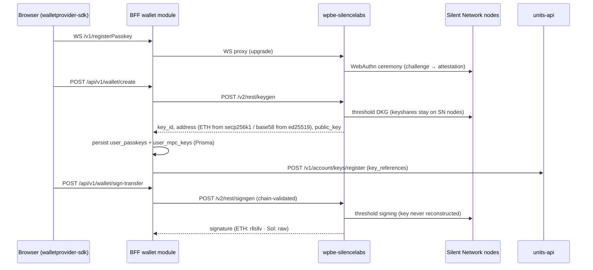

## 10. Proof Generation

```mermaid
flowchart LR
    T[(transactions<br/>proof_id IS NULL,<br/>status completed)] -->|"batch = exactly MERKLE_BATCH_SIZE,<br/>FOR UPDATE"| P[proofService]
    TT[(token_transactions)] --> P
    P -->|"BLAKE3 Merkle tree<br/>leaf = blake3(canonical JSON)"| PR[(proofs<br/>proof_data {root, per-leaf paths}<br/>status 'proven')]
    P -->|stamp proof_id| T & TT
    API["units-api<br/>/v1/transaction/proof · /leaf · /verify"] --> PR
    ANCHOR["anchoring (proven → anchored):<br/>NOT IMPLEMENTED — ledger_anchors always NULL"]:::warn
    classDef warn stroke-dasharray: 5 5
```

## 11. Database ER Overview

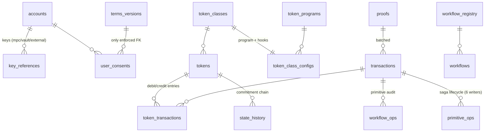

Separate databases: **central registry** (accounts-directory, instances, developer credentials, delegations — 12 tables) · **BFF Prisma** (oidc_clients, provider_journeys, integration_providers, user_wallet_links, user_passkeys, user_mpc_keys) · **alchemyAdapter** (chain_adapter_intents, chain_adapter_transactions). Full column detail: [06-database-schemas.md](06-database-schemas.md).

## 12. primitive_ops — the Saga Backbone (writer ownership)

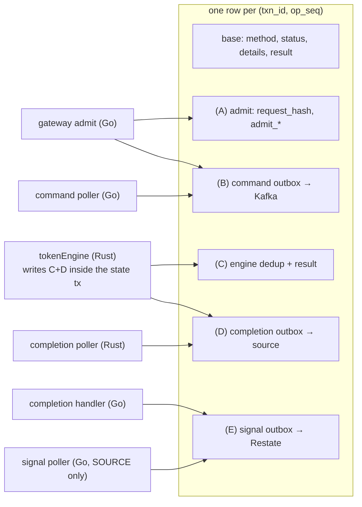

Every writer uses targeted `UPDATE … WHERE (txn_id, op_seq)` on its own column group — never full-row upserts. Three partial indexes let each poller scan only its own pending rows.
